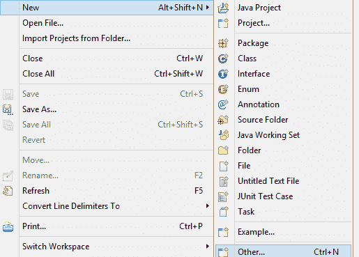
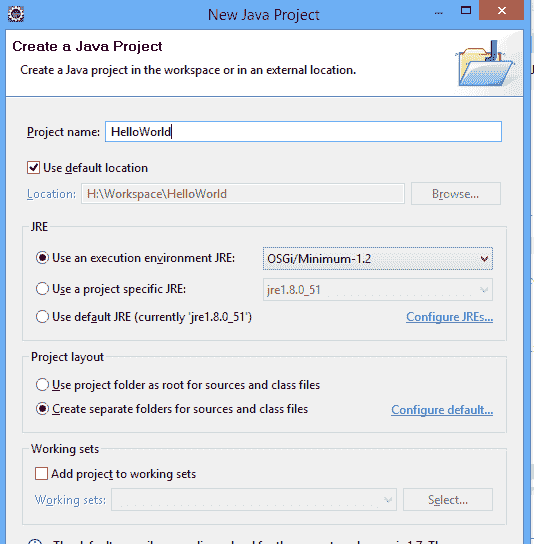
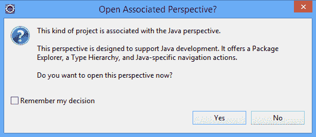
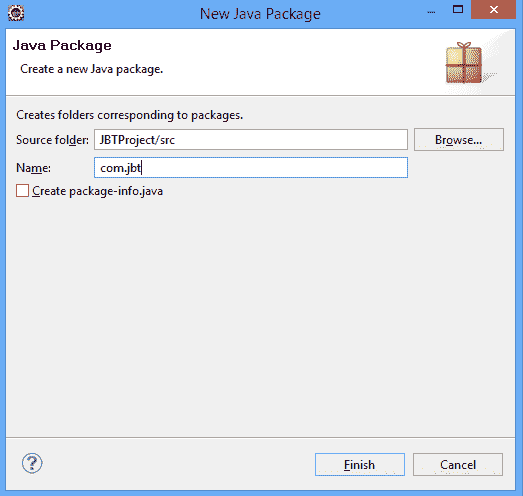
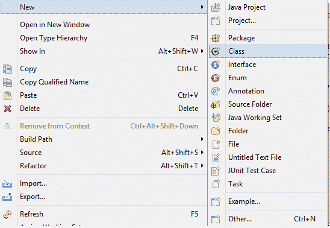
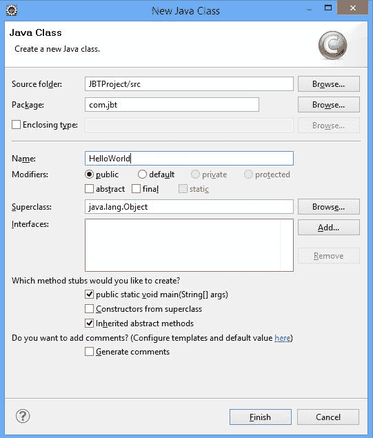

# 使用 Eclipse 编写 Hello World 程序

> 原文： [https://javabeginnerstutorial.com/core-java-tutorial/write-hello-world-application-using-eclipse/](https://javabeginnerstutorial.com/core-java-tutorial/write-hello-world-application-using-eclipse/)

在本教程中，我们将学习使用 Eclipse IDE 创建 Hello World 应用。 要了解以下材料，您应该熟悉如何使用 Eclipse 来获得有关 Eclipse [的说明，请单击此处](https://javabeginnerstutorial.com/eclipse-2/eclipse-beginners-tutorial-2/)。

## 创建项目

要创建我们的项目，请从菜单中选择“**文件 -> 新建 -> Java 项目**”。 如果找不到“Java 项目”作为选项，请单击“其他”，如下所示。

从下一个窗口中选择 Java 项目，然后单击“**下一步**”。 提供一个项目名称，如下所示。

单击“**完成**”。 Eclipse 将要求您将透视图更改为 Java 视图。 单击是。 如您所见，一个新的 Java 项目将出现“**Java 视图**”的“**包浏览器视图**”中。

## 创建一个包

现在，我们将为我们的 Java 项目创建一个包。 **包**用于避免*命名冲突*，以便*控制访问*（访问修饰符）和*捆绑相关类型*的组。

要创建包，请在 Java 项目（`JBTProject`）中选择`src`文件夹，右键单击该文件夹并选择“**新建 -> 包**”。

在对话框中输入包名称，然后单击“完成”。

## 创建 Java 类的步骤

创建包后，我们可以在包内创建 Java 类。 右键单击要在其中创建 Java 类的包，然后选择“**新建 -> 类**”。

在对话框中提供类名称，然后单击完成。 其他选项可供选择。 选择其他选项以创建您的`main`方法。

创建类之后，项目的结构将如下所示。

## 编译和运行 Java 应用

创建 Java 应用之后，下一步就是编译并运行代码。

### 编译代码

要编译代码，请使用键盘快捷键`CTRL + B`。 它将构建 Java 应用。 如果要构建单个应用，请单击该应用，然后从菜单中选择“**项目 -> 构建项目**”。

### 运行代码

要运行代码，您可以使用键盘快捷键`ALT + SHIFT + X`和`J`。

或者，您可以单击文件，然后从菜单中选择“**运行 -> 运行为 -> Java 应用**”。

单击“运行”后，将执行 Hello World 应用，并且您的输出将显示在“**控制台视图**”中。

现在我们已经学会了在 Eclipse 中创建 Hello World 应用。 在下一篇文章中，我们将讨论 Eclipse 提供的一些其他功能，这些功能使编码更容易。

<https://www.youtube.com/embed/79l5QSuI4ko?feature=oembed>

