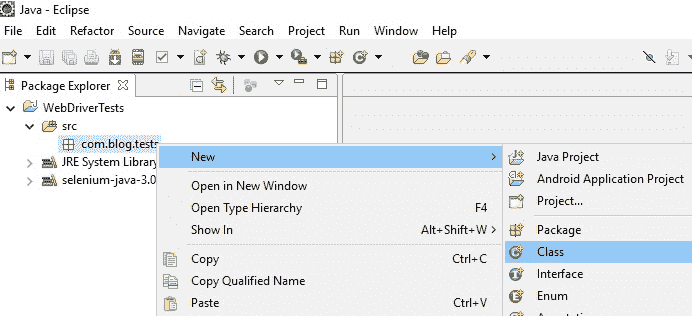
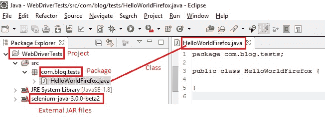
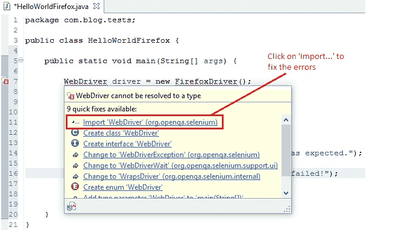

# 9c。 WebDriver – 启动 Firefox 的第一个测试脚本

> 原文： [https://javabeginnerstutorial.com/selenium/9c-webdriver-first-test-script-firefox/](https://javabeginnerstutorial.com/selenium/9c-webdriver-first-test-script-firefox/)

Hiya everyone! Time to grab a cup of Java, I mean coffee 😉

事不宜迟，让我们开始使用 WebDriver 中的第一个测试脚本。 在我们根据[上一篇文章](https://javabeginnerstutorial.com/selenium/9b-webdriver-eclipse-setup/)（添加了 WebDriver JAR 文件）创建的同一项目下，我创建了一个名为 com.blog.tests 的新程序包。

接下来，右键单击包-> New-> Class。



我将班级命名为“ **HelloWorldFirefox.java** ”。 创建所有这些文件后，“ Package Explorer”窗格将如下所示，



我们将在第一个测试脚本中考虑的场景是：

1.  打开 Firefox 浏览器。
2.  导航到“ https://www.google.com/”
3.  将页面标题声明为“ Google”。
4.  根据声明结果在控制台上显示一条消息。
5.  关闭浏览器。

***便笺* **： *我们有一整篇文章专门用于声明和验证。 由于第一个脚本的主要座右铭是查看 WebDriver 的工作原理，因此让我们使用简单的 if-else 语句来比较实际和预期的页面标题。*

**代码如下，**

```java
package com.blog.tests;

import org.openqa.selenium.WebDriver;
import org.openqa.selenium.firefox.FirefoxDriver;

public class HelloWorldFirefox {

	public static void main(String[] args) {
//Selenium version 3 beta releases require system property set up
System.setProperty("webdriver.gecko.driver", "E:\\Softwares\\
			Selenium\\geckodriver-v0.10.0-win64\\geckodriver.exe");
		//Create a new instance for the class FirefoxDriver
		//that implements WebDriver interface
		WebDriver driver = new FirefoxDriver();
		//Assign the URL to be invoked to a String variable
		String baseUrl = "https://www.google.com";
		String pageTitle = "";
		String expectedTitle = "Google";
		//Open baseUrl in Firefox browser window
		driver.get(baseUrl);
		//Get the page title and assign to a String variable
		pageTitle = driver.getTitle();
		//Check if obtained page title matches with the expected title
		//and print the console output accordingly
		if(pageTitle.equals(expectedTitle)){
			System.out.println("Hello World! Result is as expected.");
		}else{
			System.out.println("Hello World! Assertion failed!");
		}
		//Close the Firefox browser
		driver.quit();
	}
}
```

我知道外表令人生畏！ 不过不用担心 我们将阐明所有这些代码，并找出其含义。 让我们逐行走下去，不遗余力。

## *代码演练：*

#### 1.系统属性设置。

```java
System.setProperty("webdriver.gecko.driver", "E:\\Softwares\\Selenium\\
                           geckodriver-v0.10.0-win64\\geckodriver.exe");
```

Selenium 3 Beta 版本不像 Selenium 2\. *版本那样支持直接启动 Firefox。 因此，必须通过“ webdriver.gecko.driver”系统属性设置驱动程序可执行文件“ geckodriver.exe”的路径。 指定在系统中相应保存可执行文件的路径。

#### 2.接下来，为了实例化 Firefox 浏览器，我们将必须导入两个包。

键入后，“ **WebDriver 驱动程序=新的 FirefoxDriver（）;** ”，在“ WebDriver”和“ FirefoxDriver（）”下方会出现一条波浪线。 悬停时，蚀将建议所有可能的快速修复。 单击建议导入相应程序包的第一个修复程序。



*   以下包指定了 WebDriver 接口，该接口用于根据需要实例化新的浏览器窗口。

```java
import org.openqa.selenium.WebDriver
```

***即时贴：*** *我们**不要**说，* *WebDriver* *驱动程序* *=* ***新的*** *WebDriver（）；* *因为 WebDriver 是一个接口，并且只包含已定义但未实现的空方法。 因此无法实例化。*

*   FirefoxDriver 是特定于 Firefox 浏览器的类。 它具有根据接口 WebDriver 定义和实现的方法。 因此，这可以实例化。

```java
import org.openqa.selenium.firefox.FirefoxDriver
```

因此，以下声明有点像我们的甘道夫。 （不要告诉我您还没有阅读或观看“指环王”系列！！）SeleniumVille 历来最强大，最受尊敬的台词。 因为它为 FirefoxDriver 类创建了一个对象。 现在，根据 WebDriver 接口的约定，通过调用 FirefoxDriver 类中已经实现的方法，我们现在可以使用此对象（在这种情况下为“驱动程序”）自动执行 Firefox 浏览器上的各种操作。

```java
WebDriver driver = new FirefoxDriver();
```

将启动的 Firefox 浏览器将具有默认配置文件。 它不会随 Firefox 实例一起加载任何扩展程序和插件，并且会在安全模式下运行。 如果您想了解有关 Firefox 配置文件的更多信息，请访问“ https://support.mozilla.org/en-US/kb/profiles-where-firefox-stores-user-data”。

同样，对于其他浏览器（例如 Chrome，IE，Safari 等），我们按照 WebDriver 接口中指定的相同协定（即，实现接口中定义的方法）编写特定的类。 在下一篇文章中，我们将通过特定示例了解如何使用其他浏览器。

#### 3.现在，声明 String 类型的必要变量。

```java
String baseUrl = "https://www.google.com";
String pageTitle = "";
String expectedTitle = "Google";
```

我猜很简单，自我解释。 我们只是声明 String 类型的变量并为其分配值。 **baseUrl** 是我们希望在 Firefox 浏览器窗口中为测试场景调用的 URL。 目前， **pageTitle** 保持为空，因为这将是我们将从浏览器中获取的实际值。 **ExpectedTitle** 是将与实际值进行比较的期望值。

#### 4.导航到 Google 页面。

```java
driver.get(baseUrl);
```

这是我们要做的第一件事。 “获取”方法用于导航到指定的 URL。 在这种情况下为 [https://www.google.com](https://www.google.com) 。

***即时贴：*** *驱动程序* *.navigate（）。to（* *baseUrl* *）; 也达到相同的结果。 试试看！*

#### 5.获取页面标题。

```java
pageTitle = driver.getTitle();
```

页面标题的实际值可以使用 getTitle（）方法获得。 然后将标题保存到变量 pageTitle 中，以供进一步声明。

#### 6.比较页面标题并在控制台中显示结果。

```java
if(pageTitle.equals(expectedTitle)){
   System.out.println("Hello World! Result is as expected.");
}else{
   System.out.println("Hello World! Assertion failed!");
}
```

检查存储在 pageTitle 中的实际值是否等于辅助值的期望值。 System.out.println（）打印指定的参数和换行符。 这里只是纯 Java！

#### 7.关闭浏览器窗口。

```java
 driver.quit();
```

quit（）方法关闭所有浏览器窗口，并完全结束 WebDriver 会话。 这样可以避免在未正确清除任何相关文件的情况下可能发生的内存泄漏。

***便签*** ****： *驱动程序* *.close（）; 也可以使用* *。 不同之处在于，它将关闭当前关注的浏览器窗口。*

让我们在这里休息一下，好好沉浸其中！ 我们将在下一篇文章中执行此测试。

再见。 祝你有美好的一天！

