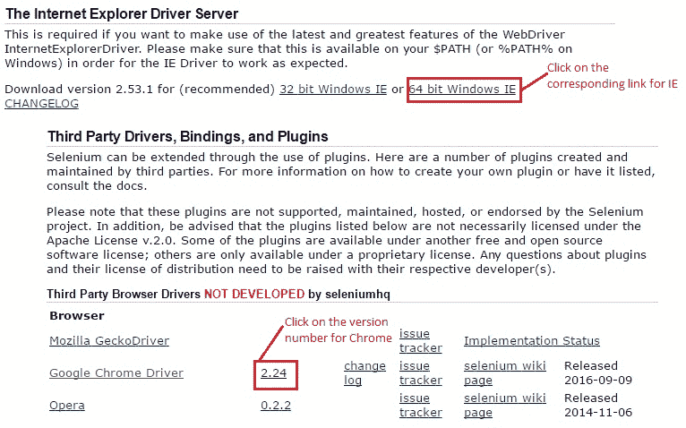
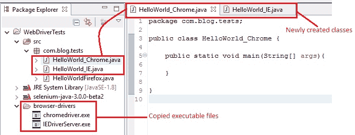
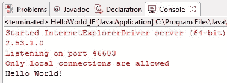

# 9e。 WebDriver – 用于启动其他浏览器的代码示例

> 原文： [https://javabeginnerstutorial.com/selenium/9e-webdriver-code-launching-browsers/](https://javabeginnerstutorial.com/selenium/9e-webdriver-code-launching-browsers/)

如果您只能使用 Selenium（即 Firefox）在一个浏览器中自动化测试，但您的 Web 应用也支持 Chrome 和 IE，该怎么办？ 这意味着所有三个浏览器都需要测试！ 如果是这种情况，那么 Selenium 就像把头埋在沙子里一样有用。

哦，不要惊慌！ 我们的统治冠军 WebDriver 在这里为我们提供帮助。 这是我们今天的主题。 让我们潜入吧！

**第 1 步**：首先！ 让我们下载所需的可执行文件。 转到“ www.seleniumhq.org/download”。

*   `InternetExplorerDriver`在“Internet Explorer 驱动程序服务器”部分下可用。
*   `ChromeDriver`，`OperaDriver`和`SafariDriver`位于“第三方浏览器驱动程序”部分下。

在本文中，我们将仅讨论`InternetExplorerDriver`和`ChromeDriver`。 设置其他浏览器也应遵循类似的步骤。



**步骤 2**：下载可执行文件后，解压缩并将它们保存在所需的路径中。 我在 Eclipse IDE 的项目中创建了一个名为“浏览器驱动程序”的文件夹（右键单击包->新建->文件夹），并复制了下载的文件以便于访问。

**步骤 3**：现在，让我们通过“右键单击包-> New-> Class”并将它们命名为“`HelloWorld_IE.java`”，创建两个新类。 和“`HelloWorld_Chrome.java`”。

包浏览器窗格现在如下所示，



让我们考虑一个非常简单的情况，因为我们的主要目标是查看是否可以启动 IE 和 Chrome 浏览器，

1.  根据测试用例打开 IE / Chrome 浏览器。
2.  导航到“ https://www.google.com/”
3.  在控制台中显示“ Hello World”消息。
4.  关闭浏览器。

**首先让我们看看“`HelloWorld_IE.java`”类的代码**

```java
package com.blog.tests;

import org.openqa.selenium.WebDriver;
import org.openqa.selenium.ie.InternetExplorerDriver;

public class HelloWorld_IE {

	public static void main(String[] args){
		//System property set up
		System.setProperty("webdriver.ie.driver", "browser-   drivers\\IEDriverServer.exe");
		//Create a new instance for the class InternetExplorerDriver
		//that implements WebDriver interface
		WebDriver driver = new InternetExplorerDriver();
		//Assign the URL to be invoked to a String variable
		String baseUrl = "https://www.google.com";
		//Open baseUrl in IE browser window
		driver.get(baseUrl);
		//Print the message to console
		System.out.println("Hello World!");
		//Close the IE browser
		driver.quit();
	}
} 
```

如果注意到的话，此代码与我们在上一篇文章“**第一个测试脚本 – 通过启动 Firefox**”中看到的代码非常相似。

这些其他浏览器需要设置系统属性，因为不支持直接启动该属性。

```java
System.setProperty("webdriver.ie.driver", "browser-drivers\\IEDriverServer.exe");
```

要求驱动程序可执行文件“ IEDriverServer.exe”的路径必须由“ webdriver.ie.driver”系统属性设置。 指定在系统中相应保存可执行文件的路径。

为了实例化 IE 浏览器，需要进行的另一项主要更改是，

```java
WebDriver driver = new InternetExplorerDriver();
```

键入此语句后，“ WebDriver”和“ InternetExplorerDriver（）”下方会出现一条波浪线。 悬停时，日食将建议所有可能的快速修复。 单击建议导入相应程序包的第一个修复程序。

```java
import org.openqa.selenium.WebDriver;
import org.openqa.selenium.ie.InternetExplorerDriver;
```

根据提供的注释，以下代码看起来很不言自明。 IE 浏览器启动后，它便导航到 google 页面，将“ Hello World”消息打印到控制台并关闭浏览器窗口。

执行此测试后的控制台窗口如下所示，



**`HelloWorld_Chrome.java`**类的代码，

```java
package com.blog.tests;

import org.openqa.selenium.WebDriver;
import org.openqa.selenium.chrome.ChromeDriver;

public class HelloWorld_Chrome {

	public static void main(String[] args) {
		// System property set up
		System.setProperty("webdriver.chrome.driver", "browser-drivers\\chromedriver.exe");
		// Create a new instance for the class ChromeDriver
		// that implements WebDriver interface
		WebDriver driver = new ChromeDriver();
		// Assign the URL to be invoked to a String variable
		String baseUrl = "https://www.google.com";
		// Open baseUrl in IE browser window
		driver.get(baseUrl);
		// Print the message to console
		System.out.println("Hello World!");
		// Close the IE browser
		driver.quit();
	}
}
```

如果将此代码与“ HelloWorld_IE.java”进行比较，则只有两个值得注意的变化。

1.  系统属性设置
2.  ChromeDriver 类实例化

因此，我们可以得出结论，通过指定相应的系统属性并提供准确的驱动程序类实例化，可以借助 WebDriver 轻松启动和自动化相应的浏览器。

在执行 Chrome 浏览器的代码后，控制台窗口如下所示，


我猜想，WebDriver 终于慢慢地在阳光下崭露头角了！ 如果您在启动各种浏览器时遇到任何问题，欢迎大家在评论部分中表达自己的意见。

在那之前，在另一篇文章中再见！ 祝你今天愉快！

