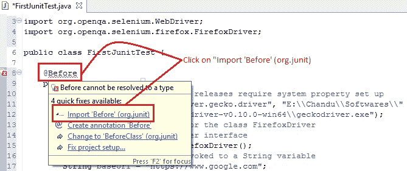
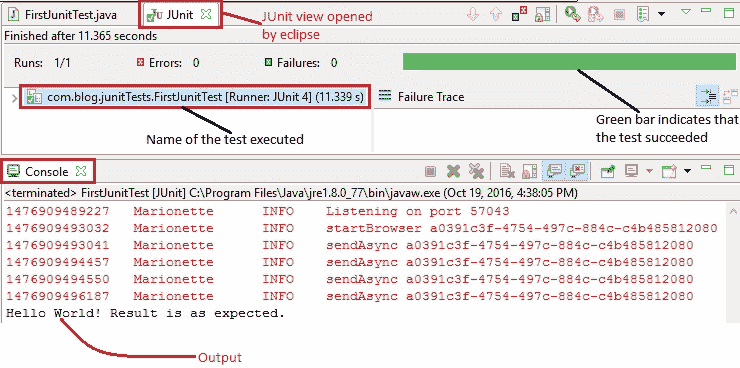

# 9 克 WebDriver – 在 JUnit4 中运行 WebDriver 测试

> 原文： [https://javabeginnerstutorial.com/selenium/9g-webdriver-running-tests-junit4/](https://javabeginnerstutorial.com/selenium/9g-webdriver-running-tests-junit4/)

欢迎来到我们的 WebDriver 系列中的另一篇有趣的文章！ 今天它会很有趣（可能比吃自己喜欢的巧克力要有趣得多）。

您准备好将帽子戴上戒指了吗？ 如果是，那就开始吧！

展望未来，我们所有的测试都将使用 JUnit 框架。 因此，是时候通过右键单击项目（已设置硒和 junit）创建新程序包了->新建->程序包。 我已将程序包命名为“ com.blog.junitTests”。

我们的下一步是创建一个类。 右键单击新创建的包-> New-> Class。 给它起一个名字“ FirstJunitTest.java”，然后单击“完成”。 您的 IDE 现在看起来应该与此类似，


现在我们已经准备好上课的文件了，让我们采用与“ [**第一个测试脚本 – 通过启动 Firefox**](https://javabeginnerstutorial.com/selenium/9c-webdriver-first-test-script-firefox/) ”帖子中相同的方案。

1.  打开 Firefox 浏览器。
2.  导航到“ https://www.google.com/”
3.  将页面标题声明为“ Google”。
4.  根据声明结果在控制台上显示一条消息。
5.  关闭浏览器。

选择相同方案的原因是代码说明保持不变。 无论有没有 JUnit 框架，这都将帮助您清楚地看到代码中的更改。

***<u>便笺</u>*** **：** *这不是 JUnit 教程。 但是，将在需要时提供基本的解释，以使您有一个全面的了解。 有关详细和完整的信息，请参考* [http://junit.org/junit4/](http://junit.org/junit4/) *。*

**代码**如下，

```java
package com.blog.junitTests;

import org.junit.*;
import org.openqa.selenium.WebDriver;
import org.openqa.selenium.firefox.FirefoxDriver;

public class FirstJunitTest {
	//Declaring variables
	private WebDriver driver; 
	private String baseUrl;
	private String pageTitle;
	private String expectedTitle;

	@Before
	public void setUp() {
		//Selenium version 3 beta releases require system property set up
		System.setProperty("webdriver.gecko.driver", 
                       "E:\\Selenium\\geckodriver-v0.10.0-win64\\geckodriver.exe");
		// Create a new instance for the class FirefoxDriver
		// that implements WebDriver interface
		driver = new FirefoxDriver();
		// Assign the URL to be invoked to a String variable
		baseUrl = "https://www.google.com";
		pageTitle = "";
		expectedTitle = "Google";
	}

	@Test
	public void testPageTitle(){
		// Open baseUrl in Firefox browser window
		driver.get(baseUrl);
		// Get the page title and assign to a String variable
		pageTitle = driver.getTitle();
		// Check if obtained page title matches with the expected title
		// and print the console output accordingly
		if (pageTitle.equals(expectedTitle)) {
			System.out.println("Hello World! Result is as expected.");
		} else {
			System.out.println("Hello World! Assertion failed!");
		}
	}

	 @After
	  public void tearDown() throws Exception{
		// Close the Firefox browser
		driver.quit();
	}
}
```

如果将此代码与实施 JUnit 之前的代码进行比较，将会有明显的变化，

1.  注释：@ Before，@ Test 和@After
2.  方法：setUp（），testPageTitle（），tearDown（）
3.  类开头的私有变量声明
4.  在新创建的方法下，将相同的代码分为几部分

这会使视力模糊吗？ 不要担心！ 让我们立即清除雾气！！

大字警报！ **注释：**这些将特定的含义传达给 JUnit。 他们告诉 JUnit，应该附加到它的*公共无效*方法，

**@Test** – 被当作测试方法运行。

**@Before** – 在指定的每种测试方法之前运行。 这用于各种目的。 读取或分配数据，初始化或如果多个测试需要先创建相似的对象才能执行，则最好在之前注释的方法下进行指定。

**@After** – 在执行每种测试方法之后运行。 通常，会指定与环境清理相关的命令，例如，关闭打开的资源/数据库连接，删除临时数据，释放内存等。即使@Before 或@Test 方法引发异常，也可以保证运行带 after 注释的方法。

键入这些注释，在它们下方会出现一条弯曲的线。 悬停时，日食将建议所有可能的快速修复。 单击建议导入 *org.junit* 程序包的第一个修复程序。



在这三个注释下的**方法**是*公共*，返回类型为 *void* 。 在 *junit.framework.TestCase* 类下，我们有 **setUp（）**和 **tearDown（）**方法。 最佳实践是重写这些方法，以分别编写初始化代码和清除代码。 这不仅可以防止内存泄漏，还可以使代码更易于阅读。 JUnit 首先调用 setUp（）方法，然后调用 test 方法，最后调用 tearDown（）方法。 对于附加到@Test 的每个测试方法，都会发生这种情况。

#### 要运行测试，

右键单击类->运行方式-> JUnit 测试。


将打开一个新的 Firefox 浏览器窗口，并按照代码执行测试步骤。 结果将在 Eclipse IDE 的 JUnit 视图中打开，其中显示**成功**的*绿色*条和**错误**的*红色*条。



显示测试用例名称。 发生错误时，将显示堆栈跟踪。 快捷方式可用于重新运行测试，仅显示失败，查看上一个和下一个失败的测试等。下面是显示错误的示例屏幕截图。


我们到了这篇文章的结尾。 现在轮到您尝试一些实现 JUnit 框架的方案，并在注释部分大声疾呼，以防您遇到问题或得到澄清。

在另一个帖子中再见！ 祝你今天愉快！

