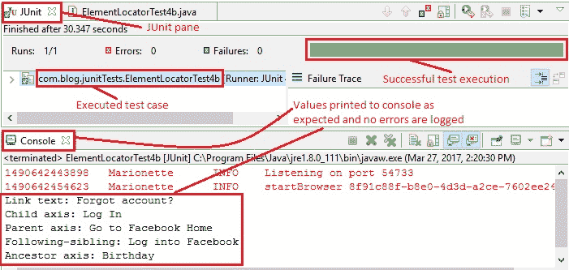

# 9o。 WebDriver – 定位元素：第 4b 部分（由 XPath 续）

> 原文： [https://javabeginnerstutorial.com/selenium/9o-webdriver-locating-elements-4b/](https://javabeginnerstutorial.com/selenium/9o-webdriver-locating-elements-4b/)

嗨冠军！ 欢迎来到我们关于定位元素的最后一篇文章。 好极了！！！

这是我们上一篇文章“ [9n。 WebDriver – 定位元素：第 4a 部分（由 XPath 提供）](https://javabeginnerstutorial.com/selenium/9n-webdriver-locating-elements-4a/)”。 您以前曾经听过我说过这个，然后您会再次听我说过……在继续使用 XPath 策略之前，请先阅读第 4a 部分。

在这篇文章中，我们将研究以下技术，

1.  使用 Text（）
2.  使用 starts-with（）
3.  使用 XPath 轴

这些技术以及我们在第 4a 部分中看到的技术可以结合起来，并用于形成有效的 XPath，该 XPath 可以定位网页上的任何元素。 现在通过示例来介绍当今的技术。

## 1.使用 text（）

通过提供与网页上显示的文本**完全相同的**，这是一种轻松定位元素的方法。****

***即时贴：***

*当心！ 即使错误地包含空格，您也可能遇到“ ElementNotFound”异常。 在代码中提供的文本必须与可见文本完全匹配，这一点非常重要，我的意思是从字面上看！*

***示例*** *：*让我们找到“ Facebook 注册”页面上的“忘记帐户？”链接。

右键点击“忘记帐户？”链接，然后选择检查元素以获取相应的 HTML 代码，如下所示，

```java
<a href="https://www.facebook.com/recover/initiate?lwv=111" 
data-testid="forgot_account_link">Forgot account?</a>
```

让我们通过提供出现在 Facebook 页面上的文本来找到此链接。

*代码：*

```java
driver.findElement(By.xpath("//a[text()='Forgot account?']"));
```

如果要查找包含部分文本的所有元素，可以将 contains（）和 text（）技术结合使用。 可以使用 findElements 方法在列表中获取所有元素。

让我们尝试在同一示例中同时实现 contains（）和 text（）。 由于我们只有一个链接与该文本，因此将使用 findElement 方法。

```java
driver.findElement(By.xpath("//*[contains(text(),'Forgot')]"));
```

## 2.使用 starts-with（）

通过指定属性的部分值（前缀），可以使用 starts-with（）查找元素。 当页面重新加载时属性值动态更改时，此功能非常有用。

***示例*** *：*让我们在“ Facebook 注册”页面上找到“新密码”文本框。

右键点击“新密码”文本框，然后选择检查元素以获取相应的 HTML 代码，

```java
<input class="inputtext _58mg _5dba _2ph-" data-type="text" 
name="reg_passwd__" aria-required="1" placeholder="" id="u_0_d" 
aria-label="New password" type="password">
```

让我们通过提供“类型”属性的部分前缀值“通过”来找到此文本框。 请注意，``登录''部分中的密码字段还具有``类型''作为``密码''。

```java
<input class="inputtext" name="pass" id="pass" tabindex="2" type="password">
```

因此，第二个元素必须位于我们的案例中。

*Code:*

```java
driver.findElement(By.xpath("(//input[starts-with(@type,'pass')])[2]"));
```

## 3.使用 XPath 轴

XPath 轴定义在当前节点浏览 DOM 的树形结构时要考虑的相对于当前节点的节点集或方向。

下表（礼貌性表示： [w3schools](https://www.w3schools.com/xml/xpath_axes.asp) ）显示了所有 13 个可用的 XPath 轴及其结果。

| **轴名称** | **结果** |
| 祖先 | 选择当前节点的所有祖先（父，祖父母等） |
| 祖先或自我 | 选择当前节点的所有祖先（父，祖父母等）和当前节点本身 |
| 属性 | 选择当前节点的所有属性 |
| 儿童 | 选择当前节点的所有子节点 |
| 后裔 | 选择当前节点的所有后代（子代，孙代等） |
| 后代或自己 | 选择当前节点的所有后代（子代，孙代等）和当前节点本身 |
| 以下 | 选择当前节点的结束标记之后的文档中的所有内容 |
| 继兄弟 | 选择当前节点之后的所有同级 |
| 命名空间 | 选择当前节点的所有名称空间节点 |
| 父母 | 选择当前节点的父节点 |
| 前 | 选择出现在文档中当前节点之前的所有节点，但祖先，属性节点和名称空间节点除外 |
| 前兄弟 | 选择当前节点之前的所有同级 |
| 自 | 选择当前节点 |

让我们来看一些重要的

### 3a。 父轴

选择当前节点的父级。

***示例*** *：*让我们找到位于 Facebook Sign Up 页面左上方的 Facebook 徽标的锚标记。

在检查元素后，

```java
<a href="https://www.facebook.com/" title="Go to Facebook Home">
   <i class="fb_logo img sp_euCDsy2vhU4 sx_af4dba">
       Facebook
   </i>
</a> 
```

*Code:*

```java
driver.findElement(By.xpath("//i[@class='fb_logo']/parent::a"));
```

将找到具有 href 和 title 属性的父节点“ a”。

### 3b。 祖先轴

选择当前节点的所有祖先（父代，祖父母等）。

***示例*** *：*让我们在“ Facebook 注册”页面上找到文字“生日”。

Upon inspecting the element,

Birthday

*Code:*

```java
driver.findElement(By.xpath("//select[@id='month']/ancestor::div[@class='_5k_5']/preceding-sibling::div"));
```

带有 ID 的“选择”标签，选择了“月”。 转到类“ _5k_5”的祖先 div 标签。 然后到其前一个带有“ div”标签的同级节点，其文本为“ Birthday”。

选择该特定示例以显示可以组合多个轴以获得所需的结果。

### 3c。 子轴

选择当前节点的所有子节点

***示例*** *：*让我们找到“ Facebook 注册”页面上的“登录”按钮。

Upon inspecting the element,

```java
 <label class="uiButton uiButtonConfirm" for="u_0_q" id="loginbutton"></label> 
```

*Code:*

```java
driver.findElement(By.xpath("//label[@id='loginbutton']/child::input"));
```

标识为“ loginbutton”的标签的子节点-标识为“ u_0_q”的输入标签。

### 3d。 后裔轴

选择当前节点的所有后代（子代，孙代等）。

***示例*** *：*让我们在“ Facebook 注册”页面上找到“名字”文本框。

Upon inspecting the element,

First name

<输入 id =“ u_0_1”类=“ inputtext _58mg _5dba _2ph-” data-type =“ text” name =“ firstname” aria-required =“ 1” placeholder =“”“ aria-label =” First name“类型 =“文字” > < / div >

*Code:*

```java
driver.findElement(By.xpath("//div[contains(@class,'uiStickyPlaceholderInput')]/descendant::input"));
```

类别为'uiStickyPlaceholderInput'的'div'标签的后代节点-ID 为'u_o_1'的输入标签已找到。

### 3e。 从动轴

选择当前节点之后的所有同级

***示例*** *：*让我们在“ Facebook 注册”页面页脚部分中找到“登录”链接。

Upon inspecting the element,

```java
<td class="_51m- hLeft plm">
   <a href="/r.php" title="Sign Up for Facebook">Sign Up</a>
</td>
<td class="_51m- hLeft plm">
   <a href="/login/" title="Log into Facebook">Log In</a>
</td> 
```

*Code:*

```java
driver.findElement(By.xpath("//td[@class='_51m- hLeft plm']/following-sibling::td/child::a"));
```

以下 td 标签的同级类 _51m-hLeft plm 是另一个 td 标签，其子对象是带有标题“登录 Facebook”的锚标签。

将后继同级和子级轴组合在一起，以在页脚部分中找到“登录”超链接。

### 3f。 上一个同级轴

选择当前节点之前的所有同级

***示例*** *：*让我们找到“ Facebook 注册”页面上的“女性”单选按钮。

Upon inspecting the element,

```java
<span class="_5k_2 _5dba">
   <input id="u_0_g" name="sex" value="1" type="radio">
   <label class="_58mt" for="u_0_g">Female</label>
</span> 
```

*Code:*

```java
driver.findElement(By.xpath("//label[@class='_58mt']/preceding-sibling::input"));
```

“标签”标签的前面同级是“无线电”类型的“输入”标签。 这样就找到了所需的单选按钮。

这样，就涵盖了一些常用的 XPath 轴类型。

我们在 BrainBell 方面一直处于停滞状态。 那为什么要延迟呢？ 开始了，

***BrainBell –*** ***注意！*** *注意您的大脑状态。*

*   *症状：* *没有任何东西被注册，开始浏览文章或忘记您刚刚阅读的内容。*
*   *诊断：* *您的大脑超负荷。*
*   *Remedy:* *Take a break! But remember to be back soon 😉*

*我将根据我的经验个人建议 **Pomodoro 技术**。 它非常有效。 试一试！*

## 总体图片

让我们来看一个测试案例，该案例实现了迄今为止本文中涵盖的所有技术，

*场景*

1.  打开 Firefox 浏览器。
2.  导航到 www.facebook.com
3.  使用 text（）找到“忘记帐户？”链接
4.  将链接文本打印到控制台
5.  使用 starts-with（）找到“新密码”文本框
6.  输入值“ test1234！”
7.  使用子轴找到“登录”按钮
8.  将值属性打印到控制台
9.  使用父轴找到 Facebook 徽标
10.  将其“标题”属性的值打印到控制台
11.  在页脚部分的“兄弟姐妹”轴中找到“登录”链接
12.  将其“标题”属性的值打印到控制台
13.  使用上一个同级轴找到“女性”单选按钮
14.  点击单选按钮
15.  使用祖先轴找到文本“生日”
16.  将其文本打印到控制台
17.  使用后代轴找到“名字”文本框
18.  输入值“首先测试”
19.  验证 Eclipse IDE 控制台的输出屏幕和 JUnit 窗格是否成功

此方案的 JUnit 代码是，

```java
package com.blog.junitTests;

import java.util.concurrent.TimeUnit;

import org.junit.After;
import org.junit.Before;
import org.junit.Test;
import org.openqa.selenium.By;
import org.openqa.selenium.WebDriver;
import org.openqa.selenium.WebElement;
import org.openqa.selenium.firefox.FirefoxDriver;

public class ElementLocatorTest4b {
    // Declaring variables
    private WebDriver driver;
    private String baseUrl;

    @Before
    public void setUp() throws Exception {
        // Selenium version 3 beta releases require system property set up
        System.setProperty("webdriver.gecko.driver", "E:\\Softwares\\Selenium\\geckodriver-v0.10.0-win64\\geckodriver.exe");
        // Create a new instance for the class FirefoxDriver
        // that implements WebDriver interface
        driver = new FirefoxDriver();
        // Implicit wait for 5 seconds
        driver.manage().timeouts().implicitlyWait(5, TimeUnit.SECONDS);
        // Assign the URL to be invoked to a String variable
        baseUrl = "https://www.facebook.com/";
    }

    @Test
    public void testPageTitle() throws Exception {
        // Open baseUrl in Firefox browser window
        driver.get(baseUrl);

        // Locate 'Forgot Account' link using XPath: text()
        WebElement forgotAccLink = driver.findElement(By.xpath("//*[contains(text(),'Forgot')]"));
        // Prints the link text to the console
        System.out.println("Link text: " + forgotAccLink.getText());
        // Locate 'New password' text box by XPath: using starts-with()
        WebElement passwordNew = driver.findElement(By.xpath("(//input[starts-with(@type,'pass')])[2]"));
        // Clear the default placeholder or any value present
        passwordNew.clear();
        // Enter/type the value to the text box
        passwordNew.sendKeys("test1234!");

        // Locate 'Log In' button using XPath: child axis
        WebElement logIn = driver.findElement(By.xpath("//label[@id='loginbutton']/child::input"));
        // Prints 'value' attribute to console
        System.out.println("Child axis: " + logIn.getAttribute("value"));
        // Locate 'Facebook' logo using XPath: parent axis
        WebElement fbLogo = driver.findElement(By.xpath("//i[contains(@class,'fb_logo')]/parent::a"));
        // Prints 'title' attribute's value to console
        System.out.println("Parent axis: " + fbLogo.getAttribute("title"));
        // Locate 'Log In' link in footer section using XPath: following-sibling axis
        WebElement loginFooter = driver.findElement(By.xpath("//td[@class='_51m- hLeft plm']/following-sibling::td/child::a"));
        //Prints 'title' attribute's value to console
        System.out.println("Following-sibling: " + loginFooter.getAttribute("title"));
        // Locate 'female' radio button using XPath: preceding-sibling axis
        WebElement femaleRadioBtn = driver.findElement(By.xpath("//label[@class='_58mt']/preceding-sibling::input"));
        // Click the radio button
        femaleRadioBtn.click();
        // Locate 'Birthday' text using XPath: ancestor axis
        WebElement birthday = driver.findElement(By.xpath("//select[@id='month']/ancestor::div[@class='_5k_5']/preceding-sibling::div"));
        //Prints text to console
        System.out.println("Ancestor axis: " + birthday.getText());
        // Locate 'first name' test box using XPath: descendant axis
        WebElement firstName = driver.findElement(By.xpath("//div[contains(@class,'uiStickyPlaceholderInput')]/descendant::input"));
        firstName.clear();
        firstName.sendKeys("test first");
    }

    @After
    public void tearDown() throws Exception {
        // Close the Firefox browser
        driver.close();
    }
}
```

*执行结果：*

这段代码将作为本文讨论的每种技术的一部分进行解释。

在 JUnit 窗口中，绿色条显示测试用例已成功执行。 控制台窗口显示没有任何错误。 它还可以按预期显示所有打印结果。



下图显示了成功执行测试脚本后获得的 Firefox 输出。


好吧！ 现在，您应该全都适应定位策略。 我们将在所有即将到来的示例中看到这些策略的应用。 因此，请继续关注此空间。

在另一个帖子中再见！ 祝你有美好的一天！

