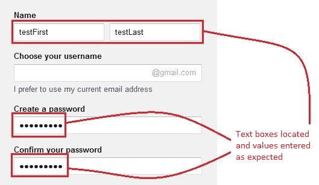
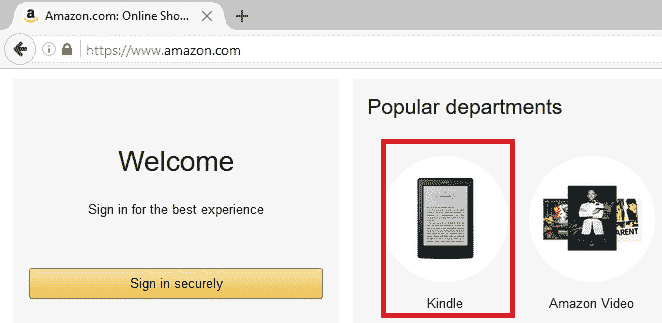
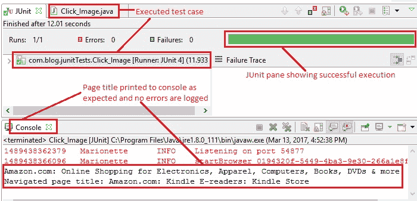
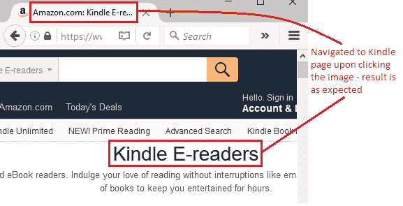

# 9s。 WebDriver – 处理文本框和图像

> 原文： [https://javabeginnerstutorial.com/selenium/9s-webdriver-handling-text-boxes-images/](https://javabeginnerstutorial.com/selenium/9s-webdriver-handling-text-boxes-images/)

嗨呀测试人员！ 如果您一直在关注我的帖子，那么您应该已经是使用 Selenium WebDriver 输入文本的专家。 如果不是（带着悲伤的表情），那就不用担心了！ 我把你们都覆盖了。

## 处理文本框

您可能正在向两种类型的输入文本框输入文本。

*   *第一种类型*是您在每个用于输入所要询问信息的网页中看到的普通文本框。 它按原样显示输入的值。
*   *第二种类型*是密码文本框，用户在其中键入一个值，出于安全原因，它显示为点或星号或任何其他特殊字符。

好消息是，对于这两种文本框类型，都可以使用相同的命令输入所需的值。

**示例**：让我们在“名字”中输入“`testFirst`”，在“创建密码”字段中输入“`test1234!”`。

**说明**：通过 **id** 找到所需的元素，然后使用`sendKeys("value")`方法输入相应的值。

考虑以下代码，

```java
<input value="" name="FirstName" id="FirstName" spellcheck="false" type="text">
<input name="Passwd" id="Passwd" type="password">
```

我们可以看到，“输入”标签具有“`id`”属性，名称和密码字段的属性分别为“`FirstName`”和“`Passwd`”。 使用这些 ID 定位这些网络元素后，我们将分别传递“`testFirst`”和“`test1234!`”作为它们的值。

*代码：*

```java
driver.findElement(By.id("FirstName")).sendKeys("testFirst");
driver.findElement(By.id("Passwd")).sendKeys("test1234!");
```

要清除文本框中可能存在的任何文本，请使用`clear()`方法。 它不需要任何参数。

输出如下

    

## 点击图片

可以通过多种方式选择图像。 通过 id，name，className，cssSelector，xpath 等。 我希望这样做是因为定位图像有时会非常棘手。

请使用 WebDriver 中提供的使用各种策略定位元素的[定位元素的先前帖子，以防您错过它们。](https://javabeginnerstutorial.com/selenium/9j-webdriver-locating-elements-1/)

让我们来看一个示例场景，为什么这个过程很棘手。

**示例**：导航至 [www.amazon.com](https://www.amazon.com) ，然后单击主页上显示的“ kindle”图像（与创建该帖子的日期相同）。 单击图像后，我们应该导航到相应页面。



右键点击“ Kindle”图片和检查元素。 相应的 HTML 代码是

```java
<a class="a-link-normal" href="/b/ref=br_pdt_mgUpt?_encoding=UTF8&amp;node=6669702011&amp;pf_rd_m=ATVPDKIKX0DER&amp;pf_rd_s=&amp;pf_rd_r=5VQBXJP2N17GX77H0TN9&amp;pf_rd_t=36701&amp;pf_rd_p=9c7b479f-fe0c-48f3-a1ab-c19df6492672&amp;pf_rd_i=desktop">

</a> 
```

***说明*** ：如您所见，“ img”标签既没有提供“ id”属性，也没有提供“ class”属性。 这样就很难找到一个小小的中间！ 对于您在网络上找到的大多数图像，情况就是如此。

考虑到 HTML 代码，可以使用`cssSelector`定位策略。 通过这种策略定位图像的方法有两种，

一个。 使用“ img”标签和“ src”属性

```java
driver.findElement(By.cssSelector("img[src='https://images-na.ssl-images-amazon.com/images/G/01/gateway/yiyiz/Kindle._CB300901238_.png']"));
```

b。 使用“ a”标签，使用“。”符号访问其类名。 在空格处指定其子元素，“ img”标签和“ src”属性

```java
driver.findElement(By.cssSelector("a.a-link-normal img[src='https://images-na.ssl-images-amazon.com/images/G/01/gateway/yiyiz/Kindle._CB300901238_.png']"));
```

也可以使用 **Xpath** 定位策略。 通过这种策略定位图像的方法有两种，

一个。 将“ a”标签与“ class”属性一起使用，从而找到其子元素“ img”

```java
driver.findElement(By.xpath("//a[@class='a-link-normal']/img"));
```

b。 直接将 img 标签及其 src 属性使用

```java
driver.findElement(By.xpath("//img[@src='https://images-na.ssl-images-amazon.com/images/G/01/gateway/yiyiz/Kindle._CB300901238_.png']"));
```

*正在考虑的场景，*

1.  打开 Firefox 浏览器
2.  导航至 https：// [amazon.com](https://www.amazon.com)
3.  将页面标题打印到控制台
4.  找到主页上显示的“ Kindle”图片
5.  点击图片
6.  再次将导航的页面标题打印到控制台
7.  在 Eclipse IDE 中验证 JUnit 窗口是否成功

此方案的 JUnit 代码是，

```java
package com.blog.junitTests;

import java.util.concurrent.TimeUnit;

import org.junit.After;
import org.junit.Before;
import org.junit.Test;
import org.openqa.selenium.By;
import org.openqa.selenium.WebDriver;
import org.openqa.selenium.WebElement;
import org.openqa.selenium.firefox.FirefoxDriver;

public class Click_Image {
        //Declaring variables
        private WebDriver driver; 
        private String baseUrl;

        @Before
        public void setUp() throws Exception{
            // Selenium v3 beta releases require system property set up
            System.setProperty("webdriver.gecko.driver", "E:\\Softwares\\"
                   + "Selenium\\geckodriver-v0.10.0-win64\\geckodriver.exe");
            // Create a new instance for the class FirefoxDriver
            // that implements WebDriver interface
            driver = new FirefoxDriver();
            // Implicit wait for 5 seconds
            driver.manage().timeouts().implicitlyWait(5, TimeUnit.SECONDS);
            // Assign the URL to be invoked to a String variable
            baseUrl = "https://www.amazon.com/";
        }

        @Test
        public void testPageTitle() throws Exception{
            // Open baseUrl in Firefox browser window
            driver.get(baseUrl);
            // Printing page title to console
            System.out.println(driver.getTitle());
            // Locate an image with xpath
            WebElement kindle = driver.findElement(By.cssSelector("img[src='https://images-na.ssl-images-amazon.com/images/G/01/gateway/yiyiz/Kindle._CB300901238_.png']"));
            // Click the image
	    kindle.click();
	    // Printing page title after clicking the image
	    System.out.println("Navigated page title: "+driver.getTitle());        
}

         @After
          public void tearDown() throws Exception{
            // Close the Firefox browser
            driver.close();
        }
}
```

*执行结果：*

代码是不言自明的，因为每行都有注释。

在 JUnit 窗口中，绿色条显示测试用例已成功执行。 控制台窗口显示没有任何错误以及单击图像前后的页面标题。



下图显示了成功执行测试脚本后获得的 Firefox 输出。



现在该轮到您尝试这些新学到的技能了。

有什么问题吗 在评论部分开火！

在那之前，请在另一篇文章中见。 祝你有美好的一天！

