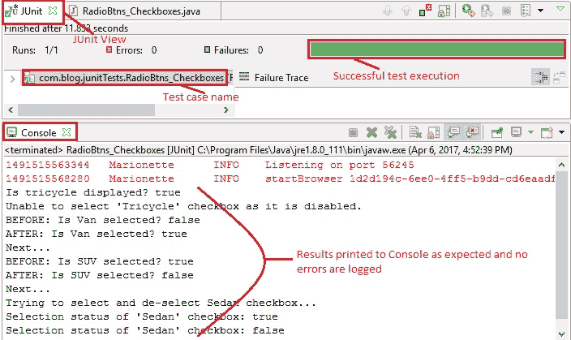
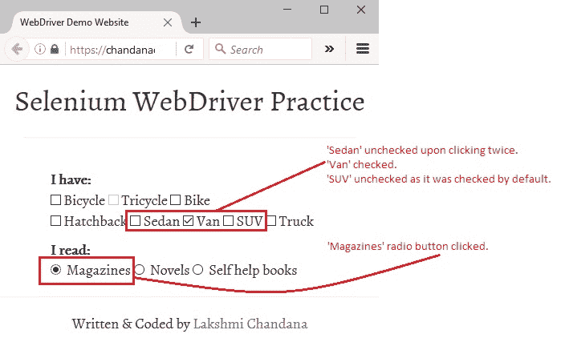

# 9 吨 WebDriver – 处理单选按钮和复选框

> 原文： [https://javabeginnerstutorial.com/selenium/9t-webdriver-handling-radio-buttons-checkboxes/](https://javabeginnerstutorial.com/selenium/9t-webdriver-handling-radio-buttons-checkboxes/)

Hiya 超级巨星！ 我知道您现在是[处理文本框和图像](https://javabeginnerstutorial.com/selenium/9s-webdriver-handling-text-boxes-images/)的专家，但是还有很多东西要学习。 让我们成为铁杆！ 让我们了解如何处理单选按钮，复选框，下拉菜单，表格，警报等，但我们一次只能看到一个。 在本文中，我们将专注于处理单选按钮和复选框。 最后，WebDriver 将使您表现出前所未有的表现力。

*<u>准备点亮</u>*

**单选按钮：**在一组单选按钮中，一次只能选择一个。 在 HTML 中，它们使用<输入>标签表示，并带有**类型的**属性，称为“ **radio”** 。

**复选框：**在一组复选框中，每个复选框都单独运行，用户可以根据需要选择多个复选框。 在 HTML 中，使用<输入>标签并将**类型**属性称为“ **复选框”** 来表示复选框。

现在我们对单选按钮和复选框的工作方式有了一些清晰的了解，让我们使用 Selenium WebDriver 进行一些有趣的操作。

1.  使用各种定位策略定位单选按钮和复选框
2.  检查是否显示单选按钮/复选框[提示：isDisplayed（）方法]
3.  检查单选按钮/复选框是否已启用，以便可以选择它[提示：isEnabled（）方法]
4.  检查默认情况下是否选中单选按钮/复选框[提示：isSelected（）方法]
5.  选择/单击单选按钮或复选框[提示：click（）]

这五个操作将与[演示站点](https://chandanachaitanya.github.io/selenium-practice-site/)中的示例一起进行说明。 它没有世界上最好的 UI，但目前已达到目的。

## **1.使用各种定位策略定位单选按钮和复选框**

是时候再利用[定位策略](https://javabeginnerstutorial.com/selenium/9j-webdriver-locating-elements-1/)的功能了！

***示例*** *：*让我们按 ID 定位“ Bicycle”复选框，按名称定位“ Tricycle”复选框，按 xPath 定位“ Sedan”复选框，并按“ Magazines”单选按钮定位 cssSelector。

右键单击所需元素，然后选择检查元素，将给出相应的 HTML 代码，如下所示，

```java
<input id="bicycle-checkbox" type="checkbox" name="vehicle1" value="Bicycle">&nbsp;Bicycle  
<input id="tricycle-checkbox" type="checkbox" name="vehicle2" value="Tricycle" disabled>&nbsp;Tricycle
<input id="sedan-checkbox" type="checkbox" name="vehicle5" value="Sedan">&nbsp;Sedan
<input id="magazines-radio-btn" type="radio" name="books" value="Magazines"> &nbsp;Magazines
```

*代码：*

```java
driver.findElement(By.id("bicycle-checkbox"));
driver.findElement(By.name("vehicle2"));
driver.findElement(By.xpath("//input[@name='vehicle5']"));
driver.findElement(By.cssSelector("input[value='Magazines']"));
```

## 2\. **检查单选按钮/复选框是否显示**

使用 Selenium WebDriver，检查特定的单选按钮或复选框是否按预期显示在网页上是小菜一碟！ 我们有 isDisplayed（）方法来进行救援。 此方法返回一个布尔值（显示 **true** – 元素，显示 **false** – element）。

***示例*** *：*让我们检查网页上是否显示了“ Tricycle”复选框。

各自的 HTML 代码供参考，

```java
<input id="tricycle-checkbox" type="checkbox" name="vehicle2" value="Tricycle" disabled>&nbsp;Tricycle
```

*Code:*

```java
driver.findElement(By.name("vehicle2")).isDisplayed();
```

## 3\. **检查单选按钮/复选框是否已启用，以便可以选择它**

同样，为了验证是否启用了特定的单选按钮或复选框，我们有 isEnabled（）方法。 这还会返回一个布尔值（ **true** – 元素已启用， **false** – 元素已禁用）。

***示例*** *：*让我们检查是否启用了“ Tricycle”复选框。 如果是的话，让我们检查一下，否则我们只会在控制台上打印一条消息。

Respective HTML code for reference,

```java
<input id="tricycle-checkbox" type="checkbox" name="vehicle2" value="Tricycle" disabled>&nbsp;Tricycle
```

*Code:*

```java
WebElement tricycleCheckbox = driver.findElement(By.name("vehicle2"));
// Check if tricyle is enabled to select
if (tricycleCheckbox.isEnabled()) {
// Click if enabled
	tricycleCheckbox.click();
} else {
	// Print message to console if disabled
	System.out.println("Unable to select 'Tricycle' checkbox as it is disabled.");
}
```

## 4\. **检查默认情况下是否选中单选按钮/复选框**

为了验证默认情况下是否选中了特定的单选按钮或复选框，我们有 isSelected（）方法。 这还会返回一个布尔值（ **true** – 元素已选择， **false** – 未选择元素）。

***示例*** *：*让我们检查一下默认情况下是否选中了“杂志”单选按钮。 如果是，请让我们将该消息打印到控制台，否则我们将单击它以选择“杂志”选项。

Respective HTML code for reference,

```java
<input id="magazines-radio-btn" type="radio" name="books" value="Magazines"> &nbsp;Magazines
```

*Code:*

```java
// Locate 'Magazines' radio button using cssSelector
WebElement magazinesRadioBtn = driver.findElement(By
				.cssSelector("input[value='Magazines']"));
// Check if radio button is selected by default
if (magazinesRadioBtn.isSelected()) {
        // Print message to console
	System.out.println("Magazines radio button is selected by default");
} else {
	// Click the radio button
	magazinesRadioBtn.click();
}
```

## 5\. **选择/单击单选按钮或复选框**

您为什么认为 Selenium WebDriver 中有 **click（）**？ 你懂我！ 选中单选按钮非常容易，对于复选框，可以使用相同的 click（）在选中和取消选中之间切换！

***示例*** *：*让我们选中并取消选中“轿车”复选框。

Respective HTML code for reference,

```java
<input id="sedan-checkbox" type="checkbox" name="vehicle5" value="Sedan">&nbsp;Sedan
```

*Code:*

```java
// Locate 'Sedan' checkbox using xPath: contains() and text()
WebElement sedanCheckbox = driver.findElement(By.xpath("//input[@name='vehicle5']"));
for (int i = 0; i < 2; i++) {
// Click the checkbox
	sedanCheckbox.click();
	// Print current status to console
	System.out.println("Selection status of 'Sedan' checkbox: "
					+ sedanCheckbox.isSelected());
} 
```

此代码将在第一个迭代中选中“轿车”复选框，然后在第二个迭代中取消选中它。 选择状态消息将相应地打印到控制台。

## **总体图片**

让我们来看一个测试案例，该案例实现了迄今为止本文中涵盖的所有操作，

*场景*

1.  打开 Firefox 浏览器。
2.  导航到[演示站点](https://chandanachaitanya.github.io/selenium-practice-site/)
3.  按名称找到“三轮车”复选框
4.  检查是否显示“三轮车”复选框，并将相应消息打印到控制台
5.  检查“三轮车”复选框是否已启用
6.  如果是，请单击复选框，如果否，则将相应消息打印到控制台
7.  根据“货车”和“ SUV”复选框的当前选择状态，选中或取消选中并在执行 click（）动作之前和之后打印状态
8.  使用 XPath 找到“轿车”复选框
9.  使用两次迭代在选择状态和取消选择状态之间切换
10.  使用 cssSelector 找到“杂志”单选按钮
11.  检查是否默认选中
12.  如果是，则将相应消息打印到控制台，否则，选择单选按钮
13.  验证 Eclipse IDE 控制台输出屏幕和 JUnit 窗格是否成功

此方案的 JUnit 代码是，

```java
package com.blog.junitTests;

import java.util.List;
import java.util.concurrent.TimeUnit;

import org.junit.After;
import org.junit.Before;
import org.junit.Test;
import org.openqa.selenium.By;
import org.openqa.selenium.WebDriver;
import org.openqa.selenium.WebElement;
import org.openqa.selenium.firefox.FirefoxDriver;

public class RadioBtns_Checkboxes {
    // Declaring variables
    private WebDriver driver;
    private String baseUrl;

    @Before
    public void setUp() throws Exception {
        // Selenium version 3 beta releases require system property set up
        System.setProperty("webdriver.gecko.driver", "E:\\Softwares\\
Selenium\\geckodriver-v0.10.0-win64\\geckodriver.exe");
        // Create a new instance for the class FirefoxDriver
        // that implements WebDriver interface
        driver = new FirefoxDriver();
        // Implicit wait for 5 seconds
        driver.manage().timeouts().implicitlyWait(5, TimeUnit.SECONDS);
        // Assign the URL to be invoked to a String variable
        baseUrl = "https://chandanachaitanya.github.io/selenium-practice-site/";
    }

    @Test
    public void testPageTitle() throws Exception {
        // Open baseUrl in Firefox browser window
        driver.get(baseUrl);

        // Locate 'Tricycle' checkbox using name
        WebElement tricycleCheckbox = driver.findElement(By.name("vehicle2"));
        // Check if tricyle is displayed
        System.out.println("Is tricycle displayed? "+ tricycleCheckbox.isDisplayed());

        // Check if tricyle is enabled to select
        if (tricycleCheckbox.isEnabled()) {
            // Click if enabled
            tricycleCheckbox.click();
        } else {
            // Print message to console if disabled
            System.out.println("Unable to select 'Tricycle' checkbox as it is disabled.");
        }

        //Get all checkbox elements in a list
        List<WebElement> list = driver.findElements(By
                .cssSelector("input[type='checkbox']"));

        // Loops through all checkboxe elements
        for (int i = 0; i < list.size(); i++) {
            // Checking if the checkbox is a 'Van' or 'SUV'
            if ((list.get(i).getAttribute("value").trim()
                    .equalsIgnoreCase("van"))
                    || (list.get(i).getAttribute("value").trim()
                            .equalsIgnoreCase("suv"))) {
                // Print selection status to console
                System.out.println("BEFORE: Is "
                        + list.get(i).getAttribute("value") + " selected? "
                        + list.get(i).isSelected());
                // Check if the checkbox is selected
                if (!(list.get(i).isSelected())) {
                    // Click the checkbox
                    list.get(i).click();
                    System.out.println("AFTER: Is "
                            + list.get(i).getAttribute("value") + " selected? "
                            + list.get(i).isSelected());
                } else {
                    // Uncheck the checkbox
                    list.get(i).click();
                    System.out.println("AFTER: Is "
                            + list.get(i).getAttribute("value") + " selected? "
                            + list.get(i).isSelected());
                }
                System.out.println("Next...");
            }
        }
        // Locate 'Sedan' checkbox using xPath
        WebElement sedanCheckbox = driver.findElement(By
                .xpath("//input[@name='vehicle5']"));
        System.out.println("Trying to select and de-select Sedan checkbox...");
        for (int i = 0; i < 2; i++) {
            // Click the checkbox
            sedanCheckbox.click();
            // Print current status to console
            System.out.println("Selection status of 'Sedan' checkbox: "
                    + sedanCheckbox.isSelected());
        }
        // Locate 'Magazines' radio button using cssSelector
        WebElement magazinesRadioBtn = driver.findElement(By
                .cssSelector("input[value='Magazines']"));
        // Check if radio button is selected by default
        if (magazinesRadioBtn.isSelected()) {
            // Print message to console
            System.out.println("Magazines radio button is selected by default");
        } else {
            // Click the radio button
            magazinesRadioBtn.click();
        }

    } //End of @Test

    @After
    public void tearDown() throws Exception {
        // Close the Firefox browser
        driver.close();
    }
}
```

*执行结果：*

除一个片段外，部分代码将作为本文讨论的每种技术的一部分进行解释。

所有类型为复选框的 Web 元素均在列表中获得，

```java
//Get all checkbox elements in a list
List<WebElement> list = driver.findElements(By.cssSelector("input[type='checkbox']")); 
```

如果列表中的所有复选框元素的属性值均与“范”和“ SUV”相匹配，则将对其进行验证。 他们的当前选择状态被打印到控制台作为一条消息，提示“之前”。

```java
// Loops through all checkboxe elements
for (int i = 0; i < list.size(); i++) {
	// Checking if the checkbox is a 'Van' or 'SUV'
	if ((list.get(i).getAttribute("value").trim().equalsIgnoreCase("van"))
||(list.get(i).getAttribute("value").trim().equalsIgnoreCase("suv"))) 
{
		// Print selection status to console
		System.out.println("BEFORE: Is "
			+ list.get(i).getAttribute("value") + " selected? "
				+ list.get(i).isSelected()); 
```

使用 isSelected（）方法，检查是否已选中“货车”或“ SUV”复选框。 如果未选中复选框，则将其选中，然后将其选择状态打印到控制台，显示“之后”。 如果已经选择了它们，然后再次单击以取消选择它们并将相应的消息打印到控制台。

```java
// Check if the checkbox is selected
if (!(list.get(i).isSelected())) {
// Click the checkbox								         list.get(i).click();
System.out.println("AFTER: Is "+ list.get(i).getAttribute("value") + " selected? "+ list.get(i).isSelected());
} else {
	// Uncheck the checkbox
	list.get(i).click();
	System.out.println("AFTER: Is "+ list.get(i).getAttribute("value") + " selected? "+ list.get(i).isSelected());
			}
	System.out.println("Next...");
	}
}
```

在 JUnit 窗口中，绿色条显示测试用例已成功执行。 控制台窗口显示没有任何错误。 它还按预期显示所有打印的消息。



下图显示了成功执行测试脚本后获得的 Firefox 输出。



是时候尝试今天的技能了。 是的，戴上安全帽，以免遇到任何异常！

再见。 祝你有美好的一天！

###### 下一篇文章

##### [9u。 WebDriver – 通过两种方式选择项目（下拉菜单和多项选择）](https://javabeginnerstutorial.com/selenium/9u-webdriver-select-items-two-ways/ "9u. WebDriver – Selecting items in two ways (Dropdowns and multiple selections)")