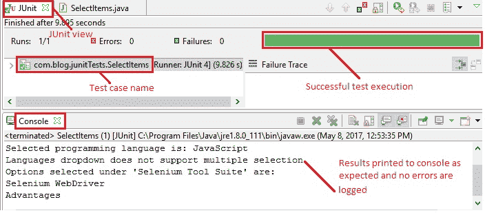
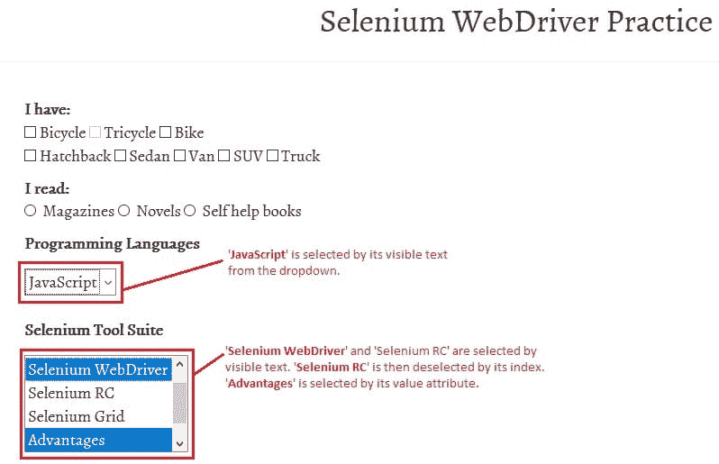

# 9u。 WebDriver – 通过两种方式选择项目（下拉菜单和多项选择）

> 原文： [https://javabeginnerstutorial.com/selenium/9u-webdriver-select-items-two-ways/](https://javabeginnerstutorial.com/selenium/9u-webdriver-select-items-two-ways/)

Hiya 摇滚明星（虽然不包括吉他和音乐）！ 在本文中，我们将深入研究下拉菜单以及如何以两种方式选择项目。 是的，我们还讨论了多个选择！ 所有概念都将与[演示站点](https://chandanachaitanya.github.io/selenium-practice-site/)中的示例一起进行说明。

# <u>方法 1：</u>

使用可用定位策略之一使用相同年代的传统元素定位方法。 首先，我们找到下拉列表元素，然后找到需要选择的项目。 由于选项没有唯一的标识符，因此这并不困难。

***示例*** *：*让我们通过 ID 查找“编程语言”下拉列表。 要从可用的下拉菜单中找到“ C++ ”，我们将必须找到标记名称为“ options”的所有元素，并将其放在列表中。 遍历列表，或者如果知道其索引，则相应地检索元素并执行单击操作。

右键单击所需元素，然后选择检查元素，将给出相应的 HTML 代码，如下所示，

```java
<select id="programming-languages" class="input-xlarge" name="languages">
			<option value="Java">Java</option>
			<option value="C++">C++</option>
```

*代码：*

```java
// Locate 'Programming Languages' dropdown using id
WebElement progLanguages = driver.findElement(By.id("programming-languages"));
//Get all options in a list
List<WebElement> options = progLanguages.findElements(By.tagName("option"));
//Iterate thorough options
for (WebElement option : options) {
	if("C++".equals(option.getText()))
	option.click();
} 
```

（要么）

```java
WebElement progLanguages = driver.findElement(By.id("programming-languages"));
List<WebElement> options = progLanguages.findElements(By.tagName("option"));
//Selecting “C++” based on its index
options.get(1).click();
```

0、1、2、3 是下拉列表的索引值。

# <u>方法 2：</u>使用“ **选择”** 类。

让我们深入研究并了解 Select 类的工作原理，并看一下它是否具有魔力。 以及为什么您首先要使用它？

使用方法 1 具有主要缺点。 由于没有唯一标识符，因此选择特定选项变得非常困难。 另外，要选择多个选项，请取消选择特定的项目，这会变得很复杂。 Selenium Webdriver 再次为我们解救！ 它为 **Select 类**提供了预定义的方法，专门用于处理下拉菜单和多选方案。

**步骤 1：**该选择类在“ org.openqa.selenium.support.ui.Select”包中可用。 因此，必须将此包导入我们的测试脚本中。

```java
import org.openqa.selenium.support.ui.Select;
```

**步骤 2：**通过传递所需的下拉标识符为 Select 类创建一个实例。

```java
Select languages = new Select(driver.findElement(By.id("element_ID")));
```

可以使用前面讨论的任何定位策略（https://javabeginnerstutorial.com/selenium/9j-webdriver-locating-elements-1/）来定位下拉列表。

**步骤 3：**找到下拉 Web 元素并创建 Select 类的对象后，就可以访问其所有方法来执行选择和取消选择。

***<u>即时贴：</u>***

*Select 类仅适用于具有< select >标签的 Web 元素。*

下面是 Select 类中所有可用方法的快照。


这里有很多要讨论和讨论的要点。 让我们通过示例和代码片段介绍一些常用的方法。

***<u>Sticky Note:</u>***

*如果找不到匹配的选项，则可能会使用所有 select 和 deselect 方法碰到 **NoSuchElementException** 。*

### **1\. selectByVisibleText（String arg0）和 deselectByVisibleText（String arg0）**

这些方法选择和取消选择一个显示的文本与传递的 String 参数完全匹配的选项。

***语法：*** *selectObject.selectByVisibleText（“ displayed_option_text”）;*

*selectObject.deselectByVisibleText（“ displayed_option_text”）;*

***示例：*** 让我们从“编程语言”下拉菜单中选择“ JavaScript”。

*代码：*（选择）

```java
// Locate 'Programming Languages' dropdown using id
WebElement languagesDD = driver.findElement(By.id("programming-languages"));
// Create an instance of 'Select' class by passing the dropdown web element
Select languages = new Select(languagesDD);
// Select 'JavaScript' language by its visible text
languages.selectByVisibleText("JavaScript");
```

（取消选择）

```java
languages.deselectByVisibleText("JavaScript");
```

### **2\. selectByValue（String arg0）和 deselectByValue（String arg0）**

这些方法选择和取消选择其 value 属性与传递的 String 参数匹配的选项。

***语法：*** *selectObject.selectByValue（“ value_attribute_text”）;*

*selectObject.deselectByValue（“ value_attribute_text”）;*

***示例：*** 让我们从 Selenium Tool Suite 多选选项中选择“ Selenium RC”。

右键单击所需的 Web 元素，然后选择 inspect 元素，将给出相应的 HTML 代码，如下所示，

```java
<select id="selenium_suite" multiple="multiple" name="selenium_suite">
	<option value="IDE">Selenium IDE</option>
	<option value="WebDriver">Selenium WebDriver</option>
	<option value="RC">Selenium RC</option> 
```

“值”属性的值“ RC”将作为参数传递给 selectByValue 方法。

*Code:*

```java
multiSelect.selectByValue("RC");
```

### **3\. selectByIndex（int arg0）和 deselectByIndex（int arg0）**

这些方法选择和取消选择指定索引值处的选项。 重要的是要注意，索引值始终以零开头。

***语法：*** *selectObject.selectByIndex（“ option_index”）;*

*selectObject.deselectByIndex（“ option_index”）;*

***示例：*** 让我们从 Selenium Tool Suite 多选选项中取消选择“ Selenium RC”。

基于 HTML 代码，Selenium IDE 的索引为 0，Selenium WebDriver 的索引为 1，Selenium RC 的索引为 2。

*Code:*

```java
multiSelect.deselectByIndex(2);
```

### **4\. deselectAll（）**

此方法清除选择。 没有传递参数。

***<u>Sticky Note:</u>***

*此方法仅适用于多选方案，即< select >标签应具有值为“ multiple”的 multi 属性。 否则抛出“ **NotImplementedError** ”。*

***语法：*** *selectObject.deselectAll（）*

***示例：*** 让我们取消选择在 Selenium Tool Suite 多重选择框中选择的所有选项。

*Code:*

```java
multiSelect.deselectAll();
```

### **5\. isMultiple（）**

当您想知道 Web 元素是否允许多选时，此方法很方便。 它返回 true 或 false。 没有传递参数。

***语法：*** *selectObject.isMultiple（）*

### **6\. getOptions（）**

此方法作为 Web 元素返回在多重选择框中可用的所有选项的列表。

***语法：*** selectObject.getOptions（）

*Code:*

```java
List<WebElement> allOptions = multiSelect.getOptions();
```

### **7\. getFirstSelectedOption（）**

此方法在多重选择框中返回第一个选定的选项。 如果在仅允许单个选择的下拉菜单中使用此选项，则将所选选项作为 Web 元素返回。

***语法：*** *selectObject.getFirstSelectedOption（）。getText（）*

这将返回所选的选项文本。

### **8\. getAllSelectedOptions（）**

此方法返回作为多选框的一部分而被选择为 Web 元素的所有选项的列表。

***语法：*** *selectObject.getAllSelectedOptions（）*

*Code:*

```java
List<WebElement> allSelectedOptions = multiSelect.getAllSelectedOptions();
```

## **总体图片**

让我们来看一个测试案例，该案例实现了迄今为止本文中涵盖的所有操作，

*场景*

1.  打开 Firefox 浏览器
2.  导航到[演示站点](https://chandanachaitanya.github.io/selenium-practice-site/)
3.  使用 ID 找到“编程语言”下拉菜单
4.  为 Select 类创建一个对象
5.  通过可见的文本选择“ JavaScript”语言
6.  将选定的选项打印到控制台
7.  检查“编程语言”下拉列表是否支持多项选择并将相应消息打印到控制台
8.  使用名称找到“ Selenium Tool Suite”多选框
9.  使用多选 Web 元素创建 Select 类的实例
10.  根据其值选择“硒 RC”和“优势”
11.  通过索引取消选择“ Selenium RC”
12.  通过可见的文本选择“ Selenium WebDriver”
13.  在列表中获取所有选定的选项，并将它们打印到控制台
14.  验证 Eclipse IDE 控制台输出屏幕和 JUnit 窗格是否成功

此方案的 JUnit 代码是，

```java
package com.blog.junitTests;
import java.util.List;
import java.util.concurrent.TimeUnit;

import org.junit.After;
import org.junit.Before;
import org.junit.Test;
import org.openqa.selenium.By;
import org.openqa.selenium.WebDriver;
import org.openqa.selenium.WebElement;
import org.openqa.selenium.firefox.FirefoxDriver;
import org.openqa.selenium.support.ui.Select;

public class SelectItems {
	// Declaring variables
	private WebDriver driver;
	private String baseUrl;

	@Before
	public void setUp() throws Exception {
		// Selenium version 3 beta releases require system property set up
		System.setProperty("webdriver.gecko.driver", "E:\\ Softwares\\"
			+ "Selenium\\geckodriver-v0.10.0-win64\\geckodriver.exe");
		// Create a new instance for the class FirefoxDriver
		// that implements WebDriver interface
		driver = new FirefoxDriver();
		// Implicit wait for 5 seconds
		driver.manage().timeouts().implicitlyWait(5, TimeUnit.SECONDS);
		// Assign the URL to be invoked to a String variable
		// baseUrl = "https://chandanachaitanya.github.io/selenium-practice-site/";
		baseUrl = "file:///E:/Chandu/My%20Blog/githubDemoSite/index.html";
	}

	@Test
	public void testPageTitle() throws Exception {
		// Open baseUrl in Firefox browser window
		driver.get(baseUrl);

		// Locate 'Programming Languages' dropdown using id
		WebElement languagesDD = driver.findElement(By.id("programming-languages"));
		// Create an instance of 'Select' class by passing the dropdown web element
		Select languages = new Select(languagesDD);
		// Select 'JavaScript' language by its visible text
		languages.selectByVisibleText("JavaScript");
		// Prints the selected option to console
		System.out.println("Selected programming language is: " + languages.getFirstSelectedOption().getText());
		// Check if languages dropdown supports multiple selection and print the result to console
		if(languages.isMultiple()){
			System.out.println("Languages dropdown supports multiple selection");
		}else {
			System.out.println("Languages dropdown does not support multiple selection");
		}

		// Locate multi select element using name
		WebElement toolSuite = driver.findElement(By.name("selenium_suite"));
		// Create an instance of 'Select' class by passing the multi select element
		Select multiSelect = new Select(toolSuite);
		// Select 'Selenium RC' by its value
		multiSelect.selectByValue("RC");
		// Select 'Advantages' by its value
		multiSelect.selectByValue("Adv");
		// De-select 'Selenium RC' by its index
		multiSelect.deselectByIndex(2);
		// Select "Selenium WebDriver" by its visible text
		multiSelect.selectByVisibleText("Selenium WebDriver");
		// Get all selected options in a list
		List<WebElement> suiteItems = multiSelect.getAllSelectedOptions();
		// Prints all selected options
		System.out.println("Options selected  under 'Selenium Tool Suite' are:");
		for (WebElement option : suiteItems) {
			System.out.println(option.getText());
		}

	} // End of @Test

	@After
	public void tearDown() throws Exception {
		// Close the Firefox browser
		driver.close();
	}
}
```

*执行结果：*

每行代码都带有不言自明的注释，并且部分代码作为帖子中涉及的每个概念的一部分进行了说明。

在 JUnit 窗口中，绿色条显示测试用例已成功执行。 控制台窗口显示没有任何错误。 它还按预期显示所有打印的消息。



下图显示了成功执行测试脚本后获得的 Firefox 输出。



这个概念并不难缠您的头。 因此，开始大量练习。 我很快会在另一篇文章中再见。 祝你有美好的一天！

