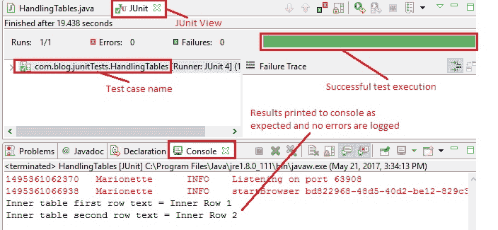

# 9v。 WebDriver – 以两种方式处理表

> 原文： [https://javabeginnerstutorial.com/selenium/9v-webdriver-handling-tables-two-ways/](https://javabeginnerstutorial.com/selenium/9v-webdriver-handling-tables-two-ways/)

嗨呀冠军！ 欢迎回到关于使用 Selenium WebDriver 处理 Web 元素的另一篇文章。 您每天都会学到一些新知识，而这就是我们今天将要学习的内容：使用和不使用 XPath 处理表！ 让我们回到我们的[演示站点](https://chandanachaitanya.github.io/selenium-practice-site/)以更好地理解这个概念。

餐桌就像到处都是名人。 好吧，是时候该去见我们的明星了！ 在整个这篇文章中，我们将使用演示站点中的“实践表”表。 在很多情况下，您可能需要检查表的特定单元格中是否存在特定数据。 因此，让我们继续前进，击中头部的粗体！

## 方法 1：不使用 XPath 处理表

在“练习表”中，我们有一个具有两行两列的表。 我们在第一行第二列中嵌套了另一个表。

**例如**：

让我们尝试访问嵌套表的第一行，并将文本“Inner Row 1”打印到控制台。 由于我们不在这里使用 XPath，因此它将变得有些复杂。 但是一旦您掌握了如何以一个嵌套级别定位一个单元，然后访问更深层次的单元就轻松了！ 第一步是使用标签名称“table”查找主表。 可以使用任何定位策略，但通常表的行和列没有 ID 或名称。 因此，访问它们的最佳方法是使用它们相应的标签名称。 第二步是使用获得的 Web 元素（表），找到嵌套表。 最后一步是，使用嵌套表 web 元素，找到第一行并获取其文本！

右键单击所需元素，然后选择检查元素，将给出相应的 HTML 代码段，如下所示，

```java
 <table class="table table-bordered">         
	<tr>          
		<td>Row 1</td>           
		<td>                 
			<table class="table table-bordered">                    
				<tr>
					<td>Inner Row 1</td>
				</tr>
                <tr>
					<td>Inner Row 2</td>
				</tr>                 
			</table> 
```

*代码：*

```java
// Locate 'Table For Practice' using tagName
WebElement practiceTable = driver.findElement(By.tagName("table"));
// Locate Inner table using tagName
WebElement innerTable = practiceTable.findElement(By.tagName("table"));
// Locate 'Inner Row 1' using tagName
WebElement innerRow1 = innerTable.findElement(By.tagName("td"));
// Print the first row text to console
System.out.println("Inner table first row text = " + innerRow1.getText());
```

## 方法 2：使用 XPath 处理表

第一种方法需要使用三个 Web 元素来访问所需的单元格。 如果涉及许多嵌套级别，则用于定位元素的命令数量将增加。 为了减轻这种情况，我们有 XPath 可以拯救我们！ “XPath”一词会响起吗？ 如果不是这样，请参考 XPath 的[定位元素以简单的方式构造它。](https://javabeginnerstutorial.com/selenium/9n-webdriver-locating-elements-4a/)

**例如**：

让我们找到嵌套表的第二行，并将其内容打印到控制台。 相对路径是 XPath 的一部分，用于定位嵌套表的所需单元格。

*Code:*

```java
// Locate 'Inner Row 2' using xPath
WebElement innerRow2 = driver.findElement(By.xpath("//table/tbody/tr[1]/td[2]/table/tbody/tr[2]/td[1]"));
```

## 总体图片

让我们一步一步地查看上面讨论的方法的代码！

*场景*

1.  打开 Firefox 浏览器
2.  导航到演示站点（ [https://chandanachaitanya.github.io/selenium-practice-site/](https://chandanachaitanya.github.io/selenium-practice-site/) ）
3.  使用标签名称找到“练习表格”
4.  使用标签名称找到嵌套表
5.  使用标签名称找到嵌套表的第一行
6.  打印文本“Inner Row 1”进行控制台
7.  使用 XPath 找到嵌套表的第二行
8.  打印文本“Inner Row 2”进行控制台

此方案的 JUnit 代码是，

```java
package com.blog.junitTests;

import java.util.concurrent.TimeUnit;

import org.junit.After;
import org.junit.Before;
import org.junit.Test;
import org.openqa.selenium.By;
import org.openqa.selenium.WebDriver;
import org.openqa.selenium.WebElement;
import org.openqa.selenium.firefox.FirefoxDriver;

public class HandlingTables {
	// Declaring variables
	private WebDriver driver;
	private String baseUrl;

	@Before
	public void setUp() throws Exception {
		// Selenium version 3 beta releases require system property set up
		System.setProperty("webdriver.gecko.driver", "E:\\Softwares\\Selenium\\geckodriver-v0.10.0-win64\\geckodriver.exe");
		// Create a new instance for the class FirefoxDriver
		// that implements WebDriver interface
		driver = new FirefoxDriver();
		// Implicit wait for 5 seconds
		driver.manage().timeouts().implicitlyWait(5, TimeUnit.SECONDS);
		// Assign the URL to be invoked to a String variable
		baseUrl = "https://chandanachaitanya.github.io/selenium-practice-site/";
	}

	@Test
	public void testPageTitle() throws Exception {
		// Open baseUrl in Firefox browser window
		driver.get(baseUrl);
		// Locate 'Table For Practice' using tagName
		WebElement practiceTable = driver.findElement(By.tagName("table"));
		// Locate Inner table using tagName
		WebElement innerTable = practiceTable.findElement(By.tagName("table"));
		// Locate 'Inner Row 1' using tagName
		WebElement innerRow1 = innerTable.findElement(By.tagName("td"));
		// Print the first row text to console
		System.out.println("Inner table first row text = " + innerRow1.getText());

		// Locate 'Inner Row 2' using xPath
		WebElement innerRow2 = driver.findElement(By.xpath("//table/tbody/tr[1]/td[2]/table/tbody/tr[2]/td[1]"));
		System.out.println("Inner table second row text = " + innerRow2.getText());
	} //End of @Test

	@After
	public void tearDown() throws Exception {
		// Close the Firefox browser
		driver.close();
	}
}
```

*执行结果：*

每行代码都带有不言自明的注释，并且作为到目前为止涵盖的概念的一部分，代码得到了很好的解释。

注意到 Eclipse IDE 的 JUnit 视图后，绿色条显示测试用例已成功执行。 控制台窗口显示没有任何错误。 它还按预期显示了两个嵌套表行的文本。



任何问题？ 在评论部分开火！

稍后再见。 祝你今天愉快！

