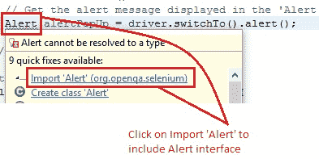
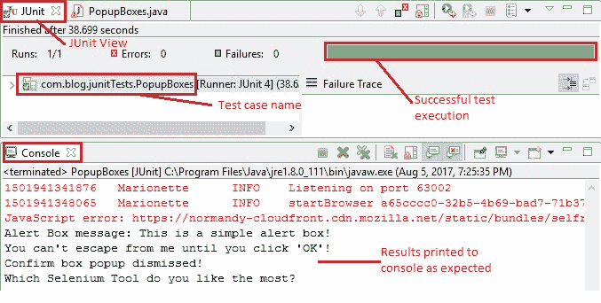

# 9X WebDriver – 处理警报/弹出框

> 原文： [https://javabeginnerstutorial.com/selenium/9x-webdriver-handling-alerts-popup-box/](https://javabeginnerstutorial.com/selenium/9x-webdriver-handling-alerts-popup-box/)

嗨呀爱好者！ 想知道为什么 Selenium WebDriver 中存在警报界面？ 好吧，我的朋友，对于您所寻找的信息，仅此帖子即可。 我们将讨论基本上属于三种类型的弹出框-警报框，确认框和提示框。 与往常一样，我们有[演示站点](https://chandanachaitanya.github.io/selenium-practice-site/)来说明这些概念。

**注意：**

*如果网页上出现一个弹出框，则只要不接受或关闭警报，用户就无法对基础页面执行任何操作。 请注意，如果您尝试使用警报访问网页上的任何元素，则可能会碰到“`UnhandledAlertException`：存在模态对话框”。*

## 1.警报框

一个简单的警报框通常用于将信息传递给用户或发出一些警告。 除非单击“确定”按钮，否则用户无法继续进行操作。

JavaScript 代码：

```java
window.alert("This is a simple alert box! \nYou can't escape from me until you click 'OK'!");
```

 

## 2\. 确认框

确认框为用户提供了两个选项，以验证/接受或关闭某些内容。 用户必须单击“确定”或“取消”才能继续。 确认弹出框返回布尔值。 当用户点击“确定”时返回`true`，而当点击“取消”时返回`false`。

JavaScript code:

```java
window.confirm("Click 'OK' or 'Cancel'.");
```


## 3\. 提示框

在我们希望用户输入值的情况下，将使用提示框。 与其他警报框类似，用户必须单击“确定”或“取消”按钮才能继续操作。 提示框在单击“确定”时返回输入值，而在单击“取消”时返回空值。

JavaScript 代码：

```javascript
window.prompt("Which Selenium Tool do you like the most?","e.g. Selenium IDE");
```


希望您现在对基于 Web 的弹出窗口的不同类型有清楚的了解。

## 处理弹出框：

Selenium WebDriver 尚未提供任何处理这些弹出框的方法。 你相信我刚才说的吗？

哈！ 我知道没有骗你的！ WebDriver 总是对我们所有问题都有答案。 **警报接口**随`org.openqa.selenium.Alert`*包*一起提供！

经常使用的一些最有用的方法是：

### 1\. `WebDriver switchTo()`

这是用于从主窗口切换到弹出窗口或显示的警报的方法。

```java
driver.switchTo().alert();
```

### 2\. `void accept()`

此方法用于接受警报。 点击“确定”按钮。

```java
driver.switchTo().alert().accept();
```

### 3\. `void dismiss()`

此方法用于消除警报。 点击“取消”按钮。

```java
driver.switchTo().alert().dismiss();
```

### 4\. `String getText()`

要使文本显示在弹出框中，请使用此方法，它将文本作为字符串返回。

```java
driver.switchTo().alert().getText();
```

### 5\. `void sendKeys(String textToSend)`

此方法用于在显示的弹出框中（通常是提示框）输入特定的`String`。

```java
driver.switchTo().alert().sendKeys(“sampleText”);
```

## 场景

让我们来看一个实现这些方法的测试用例，以更深入地了解这些概念，

1.  打开 Firefox 浏览器
2.  导航到[演示站点](https://chandanachaitanya.github.io/selenium-practice-site/)
3.  使用 ID 找到“警告框”按钮
4.  单击按钮以弹出警报框
5.  获取警报弹出窗口的显示文本并将其打印到控制台
6.  接受警报弹出窗口
7.  使用 ID 找到“确认框”按钮
8.  单击按钮以确认框弹出
9.  将警报消息打印到控制台
10.  关闭确认弹出窗口
11.  使用 XPath 找到“提示框”按钮
12.  单击按钮，弹出提示框
13.  获取提示框消息并将其显示到控制台
14.  接受提示弹出窗口
15.  验证 Eclipse IDE 控制台输出屏幕和 JUnit 窗格是否成功

此方案的 JUnit 代码是，

```java
package com.blog.junitTests;

import java.util.concurrent.TimeUnit;

import org.junit.After;
import org.junit.Before;
import org.junit.Test;
import org.openqa.selenium.Alert;
import org.openqa.selenium.By;
import org.openqa.selenium.WebDriver;
import org.openqa.selenium.WebElement; 
import org.openqa.selenium.firefox.FirefoxDriver;

public class PopupBoxes {
    // Declaring variables
    private WebDriver driver;
    private String baseUrl;

    @Before
    public void setUp() throws Exception {
        // Selenium version 3 beta releases require system property set up
        System.setProperty("webdriver.gecko.driver", "E:\\Softwares\\"
                + "Selenium\\geckodriver-v0.10.0-win64\\geckodriver.exe");
        // Create a new instance for the class FirefoxDriver
        // that implements WebDriver interface
        driver = new FirefoxDriver();
        // Implicit wait for 5 seconds
        driver.manage().timeouts().implicitlyWait(5, TimeUnit.SECONDS);
        // Assign the URL to be invoked to a String variable
        baseUrl = "https://chandanachaitanya.github.io/selenium-practice-site/";
    }

    @Test
    public void testPageTitle() throws Exception {
        // Open baseUrl in Firefox browser window
        driver.get(baseUrl);
        // Locate 'Alert Box' button using id
        WebElement alertBoxBtn = driver.findElement(By.id("alertBox"));
        // Click the button for alert box popup
        alertBoxBtn.click();
        // Switch the control to 'Alert Box' popup
        Alert alertPopUp = driver.switchTo().alert();
        // Print the alert message to console
        System.out.println("Alert Box message: " + alertPopUp.getText());
        // Accept the alert popup
        alertPopUp.accept();
        
        Thread.sleep(5000);
        
        // Locate 'Confirm Box' button using id
        WebElement confirmBoxBtn = driver.findElement(By.id("confirmBox"));
        // Click the button for confirm box popup
        confirmBoxBtn.click();
        // Switch control to 'Confirm Box' popup
        Alert confirmPopUp = driver.switchTo().alert();
        // Dismiss the popup
        confirmPopUp.dismiss();
        System.out.println("Confirm box popup dismissed!");
        
        Thread.sleep(5000);
        
        // Locate 'Prompt Box' button using XPath
        WebElement promptBoxBtn = driver.findElement(By.xpath("/html/body/form/div[4]/div[3]/button"));
        // Click the button for prompt box popup
        promptBoxBtn.click();
        // Switch control to 'Prompt Box' popup
        Alert promptPopUp = driver.switchTo().alert();
        // Display the prompt message to console
        System.out.println(promptPopUp.getText());
        // Click 'OK'
        promptPopUp.accept();    
        
    } //End of @Test

    @After
    public void tearDown() throws Exception {
        // Close the Firefox browser
        driver.close();
    }
}
```

*代码说明：*

1\.  为了实例化一个弹出框，我们将必须导入`import openqa.selenium.Alert`包。

键入上述代码后，“`Alert`”一词下方会出现一条弯曲的线。 悬停时，蚀将建议所有可能的快速修复。 单击建议导入“警报”包的第一个修补程序。



```java
// Switch the control to 'Alert Box' popup 
Alert alertPopUp = driver.switchTo().alert();
```

该包指定了`Alert`界面，该界面用于处理基于 Web 的弹出框。

“`alertPopUp`”是为引用显示的弹出窗口而创建的新实例变量。

2\. 要将控件从主窗口切换到弹出窗口，

```java
driver.switchTo().alert();
```

3\. 要使文本显示在弹出框中，请在引用所生成警报的实例变量上使用`getText()`方法。

```java
// Print the alert message to console 
System.out.println("Alert Box message: " + alertPopUp.getText());
```

4\. 要接受警报，请使用`accept()`方法。

```java
// Accept the alert popup 
alertPopUp.accept();
```

5\. 要关闭警报，请使用`dismiss()`方法。

```java
// Dismiss the popup 
confirmPopUp.dismiss();
```

*执行结果：*

在 JUnit 窗口中，绿色条显示测试用例已成功执行。 控制台窗口显示没有任何错误。 它还按预期显示所有打印的消息。



是时候练习了，我很快会在另一篇文章中见。 祝你有美好的一天！
