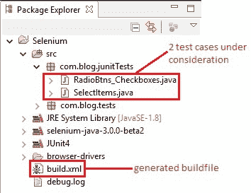
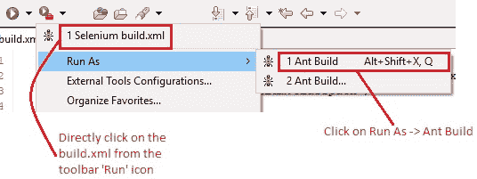
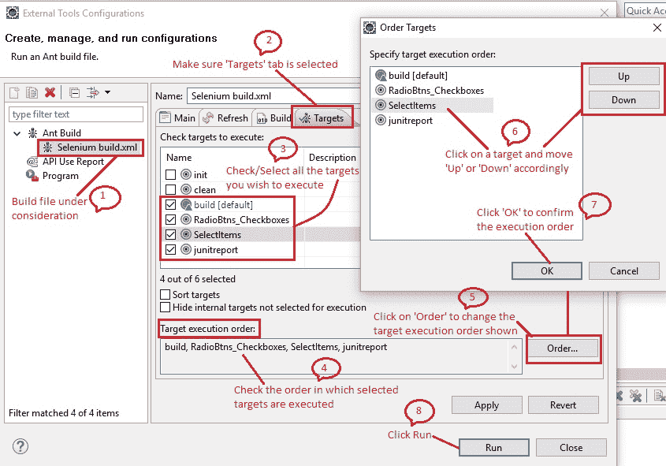
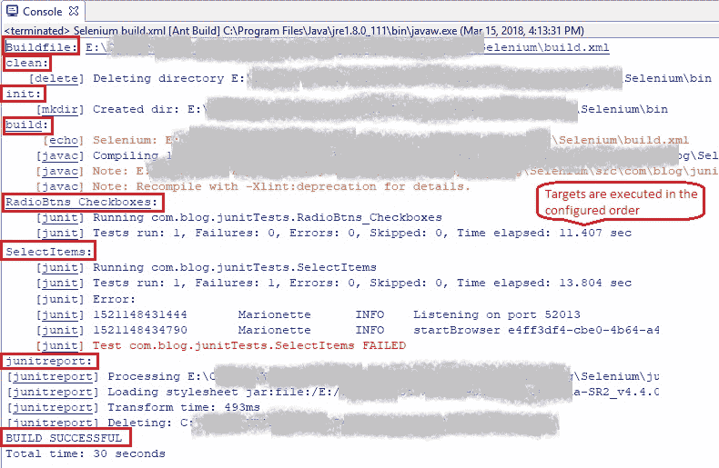
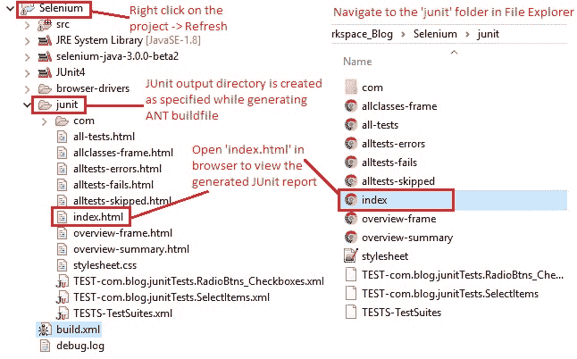
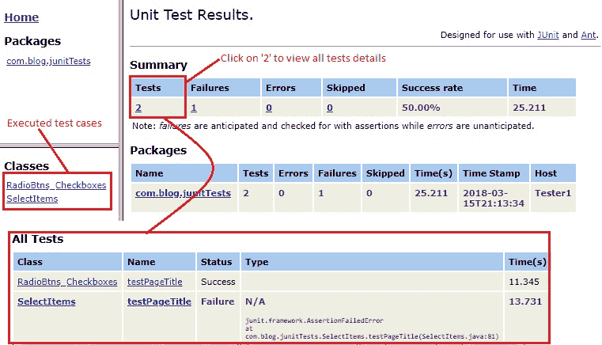

# 10B 高级 WebDriver – 生成 JUnit 报告

> 原文： [https://javabeginnerstutorial.com/selenium/10b-advanced-webdriver-generating-junit-reports/](https://javabeginnerstutorial.com/selenium/10b-advanced-webdriver-generating-junit-reports/)

嗨冠军！ 报告，报告，无处不在的报告。 从哈利·波特时代开始，我们就一直在处理这些问题！！ （还记得学校的进度报告吗？！）无论如何，报告真的很重要，尤其是在测试中，以便快速了解一切工作原理。

因此，今天，我们将使用 Apache ANT 的`junitreport`任务来生成一个任务。 准备点亮！

从我的[上一篇文章](https://javabeginnerstutorial.com/selenium/10a-advanced-webdriver-apache-ant/)中，我们生成了带有“`junit`”作为默认 JUnit 输出目录的构建文件。 用简单的英语来说，这仅意味着将作为 JUnit 报告任务的一部分生成的所有文件都放置在名为“`junit`”的目录下。

#### 步骤 1 ：

在项目“Selenium”下，将生成名为“`build.xml`”的 ANT 构建文件。 我已经在“`com.blog.junitTests`”包下创建了两个 JUnit 测试用例，分别是 [RadioBtns_Checkboxes.java](https://javabeginnerstutorial.com/selenium/9t-webdriver-handling-radio-buttons-checkboxes/) 和 [SelectItems.java](https://javabeginnerstutorial.com/selenium/9u-webdriver-select-items-two-ways/) ，如下图所示。 该代码可在相应的帖子中找到。 只需单击文件名即可进行导航。



#### **步骤 2** ：

打开“`build.xml`”，并确保自动生成“`junitreport`”任务。 以下是我的项目的目标（初始化，清理，构建，`RadioBtns_Checkboxes`，`SelectItems`和`junitreport`）。

```xml
<project basedir="." default="build" name="Selenium">
    <property environment="env"/>
    <property name="junit.output.dir" value="junit"/>
    <property name="debuglevel" value="source,lines,vars"/>
    <property name="target" value="1.8"/>
    <property name="source" value="1.8"/>
    <target name="init">
        <mkdir dir="bin"/>
        <copy includeemptydirs="false" todir="bin">
            <fileset dir="src">
                <exclude name="**/*.java"/>
            </fileset>
        </copy>
    </target>
  
    <target name="clean">
        <delete dir="bin"/>
    </target>
  
    <target name="build" depends="init">
        <echo message="${ant.project.name}: ${ant.file}"/>
        <javac debug="true" debuglevel="${debuglevel}" destdir="bin" includeantruntime="false" source="${source}" target="${target}">
            <src path="src"/>
            <classpath refid="Selenium.classpath"/>
        </javac>
    </target>
    
    <target name="RadioBtns_Checkboxes">
        <mkdir dir="${junit.output.dir}"/>
        <junit fork="yes" printsummary="withOutAndErr">
            <formatter type="xml"/>
            <test name="com.blog.junitTests.RadioBtns_Checkboxes" todir="${junit.output.dir}"/>
            <classpath refid="Selenium.classpath"/>
        </junit>
    </target>
    <target name="SelectItems">
        <mkdir dir="${junit.output.dir}"/>
        <junit fork="yes" printsummary="withOutAndErr">
            <formatter type="xml"/>
            <test name="com.blog.junitTests.SelectItems" todir="${junit.output.dir}"/>
            <classpath refid="Selenium.classpath"/>
        </junit>
    </target>
   
    <target name="junitreport">
        <junitreport todir="${junit.output.dir}">
            <fileset dir="${junit.output.dir}">
                <include name="TEST-*.xml"/>
            </fileset>
            <report format="frames" todir="${junit.output.dir}"/>
        </junitreport>
    </target>
</project>
```

#### **步骤 3** ：

可以通过以下任意一种方式执行构建，

1.右键单击“构建文件（`build.xml`）-> 运行方式 -> Ant Build”


2.右键单击“构建文件（`build.xml`）-> 运行方式 -> 外部工具配置 -> 运行”

3.蚀工具栏中的快捷方式运行图标



让我们采用第二种方法，看看如何使用“外部工具配置”选项修改现有配置。

因此，右键单击“构建文件->运行方式->外部工具配置”：这将打开一个弹出窗口。 选择“主要”标签，并确保选择了正确的构建文件。


然后点击“目标”标签。

1.  将列出构建文件中定义的所有目标名称，并且仅检查默认目标。 点击“运行”，选择要执行的所有目标。
2.  在“目标执行顺序”框中，将从上一步中选择的所有目标按执行顺序列出。
3.  如果您想更改顺序，请点击“顺序...”。 这将打开“顺序目标”弹出窗口。
4.  我们可以通过选择目标并相应地单击“上”或“下”按钮来在此弹出窗口中指定目标执行顺序。 点击“确定”以确认最终的执行顺序。
5.  完成所有操作后，点击“应用”和“运行”



#### **步骤 4** ：

可以通过查看控制台视图来验证成功执行。 它显示了按配置顺序执行的所有目标以及基于构建文件中提到的日志记录级别的日志。 如图所示，将显示运行构建所花费的总时间以及消息“`BUILD SUCCESSFUL`”或“`BUILD FAILED`”。



#### **步骤 5** ：

在 Eclipse 的“包浏览器”视图中，右键单击该项目，然后单击“刷新”或`F5`。 已经创建了“`junit`”文件夹（在生成构建文件时在“JUnit 输出目录”框中指定的名称）。 这是 JUnit 报告（`index.html`）和 XML 一起提供的地方，用于执行的每个测试用例，显示其成功或失败。



或者，在文件浏览器中导航到项目路径，然后双击“`junit`”文件夹。

#### **步骤 6** ：

在浏览器中打开“`index.html`”，并检查生成的默认报告。 这将在左窗格中显示所涉及的包和所有已执行的 Java 文件。

右窗格显示测试结果的摘要，其中包括测试的总数，失败，错误，跳过，成功率和执行时间。 还显示了包列表，其中包含类似的详细信息。

要深入查看所有已执行的测试或失败等，请单击显示的数字，如下图所示，



用 Apache ANT 生成 JUnit 报告不是一件容易的事吗？ 猜猜这就是我们今天要做的。

在另一篇文章中再见。 祝您报告愉快！
