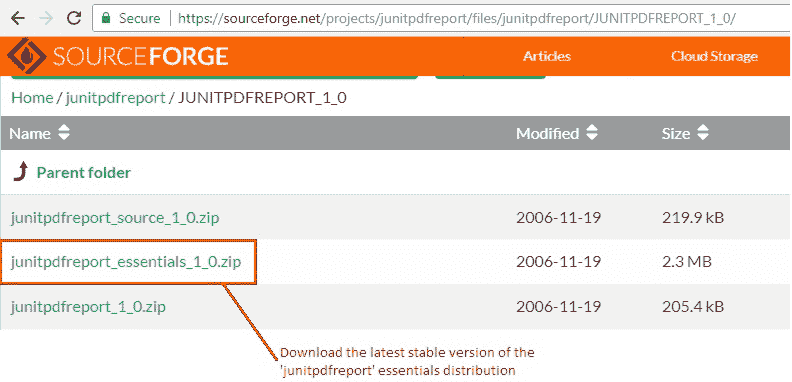
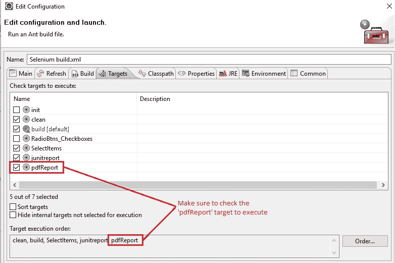
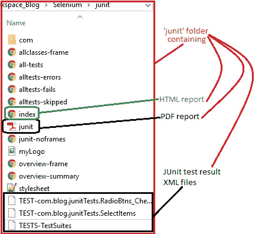
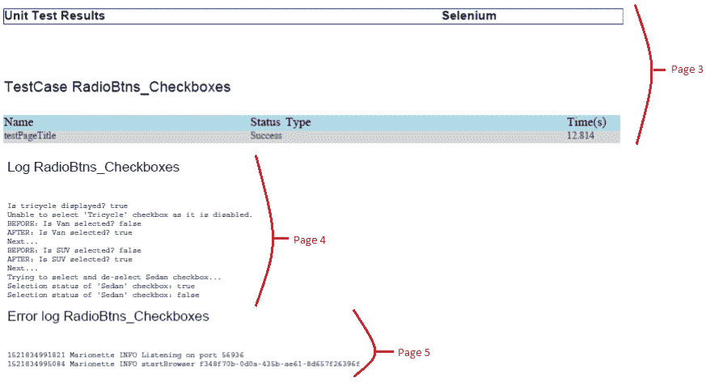

# 10e。 高级 WebDriver – 生成 PDF 报告

> 原文： [https://javabeginnerstutorial.com/selenium/10e-advanced-webdriver-generating-pdf-report/](https://javabeginnerstutorial.com/selenium/10e-advanced-webdriver-generating-pdf-report/)

嗨冠军！ 到目前为止，我们在报告方面已经涵盖了很多基础，您已经达到了高潮文章。 如果要将 HTML 报告附加到电子邮件并将其发送给利益相关者，则生成 HTML 报告可能没有帮助。 由于 ANT 生成的 JUnit 报告具有`index.html`文件，该文件又嵌入了其他一些 HTML 文件，例如`overview-frame.html`，`allclass-frame.html`和`overview-summary.html`文件。

在这种情况下我们该怎么办？ 我们如何将其附加到电子邮件？ 我们不能将其作为单个文件而不是一组 HTML 文件获得吗？ – 所有这些问题的唯一答案是，生成一个 **PDF 文件**。

让我们看看在不干扰我们到目前为止所做的[自定义](https://javabeginnerstutorial.com/selenium/10c-advanced-webdriver-junit-report-customization/)的情况下生成 PDF 报告的过程，

## 步骤 1：

我们需要 JUnit PDF 报告*要点*分发。 它还包含所有必需的依赖项。 从链接“https://sourceforge.net/projects/junitpdfreport/files/”下载最新版本的“必要” zip 文件。



将文件内容解压缩到本地文件夹并记下路径。 另外，请确保分发中包含“`build-junitpdfreport.xml`”文件和“`lib`”文件夹以及某些其他文件和文件夹。

## **步骤 2：**

是时候在 Eclipse IDE 中浏览“`Build.xml`”文件了。 有几行要添加。 首先要做的是告诉我们的项目，该`junitpdfreport`基本 zip 文件的内容在哪里提取。 在构建文件的`project`标签中，将以下行及其路径添加到分发位置。

```xml
<!-- JUnit PDF report installation location --> <import file="E:/junitpdfreport_essentials_1_0/build-junitpdfreport.xml"/>
```

## **步骤 3：**

将以下目标也添加到构建文件中，以便 ANT 知道该怎么做。

```xml
<!-- PDF Report --> <target name="pdfReport"> <junitpdfreport todir="${junit.output.dir}" styledir="default"> <fileset dir="${junit.output.dir}"> <include name="TEST-*.xml"/> </fileset> </junitpdfreport> </target>
```

让我们尝试一次解密这一行，

1\. `junitpdfreport todir="${junit.output.dir}"`

这是将生成的 pdf 报告保存的位置。

2\. `fileset dir="${junit.output.dir}"`

提供所有 JUnit 测试结果所在的位置（请记住为执行的每个测试生成的 XML 文件，格式为“`TEST-*.xml`”）。

就我而言，我有以下测试文件：`TEST-com.blog.junitTests.RadioBtns_Checkboxes.xml`，`TEST-com.blog.junitTests.SelectItems.xml`和`TESTS-TestSuites.xml`保存在位置`junit/`。

## **步骤 4：**

右键单击并选择“2 ANT Build”，然后在“编辑配置”弹出窗口中选中“目标”标签。 确保已选中“pdfReport”目标，它是执行顺序中提到的最后一个目标。



点击“运行”以执行构建文件。

## **步骤 5：**

在指定的输出目录（本例中为“`junit/`”）中验证生成的 PDF 报告。



生成的 PDF 文件共有 8 页。 例如，前 5 页如下所示，




最后但并非最不重要的是，该构建文件的快照显示了 HTML 报告和 PDF 报告目标代码，


在您达到本文结尾时，让我们利用练习的力量。 在另一个主题上再见，让您掌握 WebDriver！
