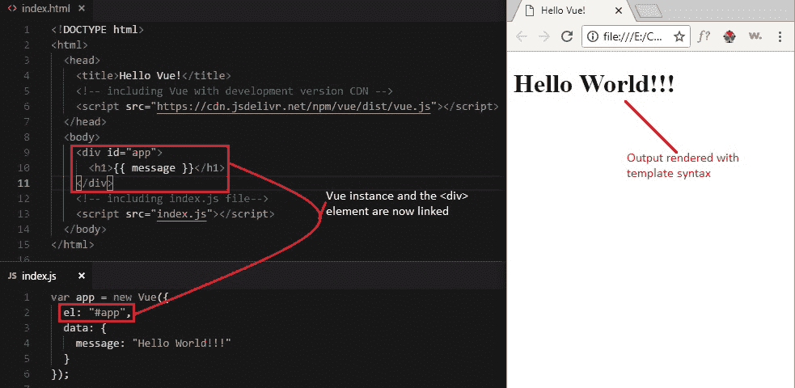
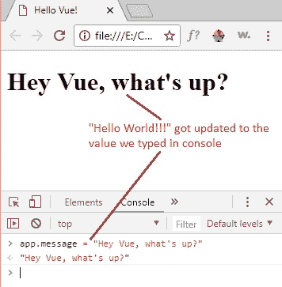
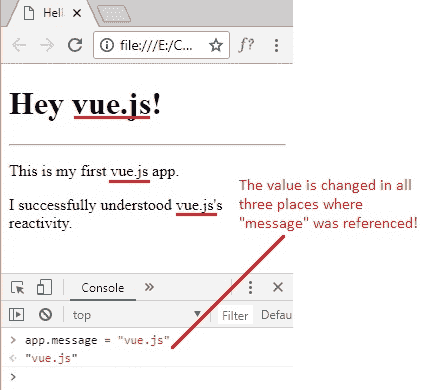

# 2.模板语法和反应式的初探

> 原文： [https://javabeginnerstutorial.com/js/vue-js/2-template-syntax-reactivity/](https://javabeginnerstutorial.com/js/vue-js/2-template-syntax-reactivity/)

嘿! 欢迎阅读关于 Vue 的另一篇有趣的文章！ 我们不仅要了解模板语法，还可以了解 Vue 的反应式。 这似乎就像我们之前的文章“[Hello World with Vue.js](https://javabeginnerstutorial.com/js/vue-js/1-hello-world-with-vue-js/) ”的继续。 因此，请确保您快速浏览一下，以了解我们到目前为止讨论的内容。 请参阅 [GitHub 仓库](https://github.com/JBTAdmin/vuejs)中的代码。

还记得我们如何在 HTML 代码中使用两个花括号将数据呈现到 DOM 吗？ 让我们深入了解它，以了解 Vue 如何在引擎盖下工作。

来自“`index.html`”的摘录，

```java
<div id="app">
    <h1>{{ message }}</h1>
</div> 
```

这个“两个大括号”的意思是“**模板语法**”，可以用它声明性地将数据渲染到 DOM。 由于系统是 Vue.js 的核心，因此这是可能的。 模板语法也称为“胡子语法”。

以下是“`index.js`”文件中的代码，

```java
var app = new Vue({
  el: "#app",
  data: {
    message: "Hello World!!!"
  }
});
```

每当遇到模板语法时，Vue 都会自动查看其数据属性的对象，并将相应的值呈现给 DOM。

您是否注意到我已将 Vue 实例分配给变量“`app`”？ 下一节将使用它来演示 Vue 附带的一些反应式！

到目前为止的输出是（就像我们在上一篇文章中看到的那样），



## 初探 Vue 的反应式

如果您认为使用模板语法进行渲染本身很棒，那么就准备惊讶吧！ 因为 Vue 是**反应式**。

*反应式*实际是什么意思？ 我们知道，在 Vue 实例中指定的数据链接到 HTML 代码中“`el`”范围内所引用的任何位置。 Vue 不仅**会在被引用的 DOM 中呈现**数据，而且**每当在数据对象中更改其值时也会更新**。

很难缠住头吗？ 然后，让我们看到所有这些实时发生的反应。

*   在 Chrome 浏览器中打开 DevTools（快捷方式：`F12`）。
*   点击“控制台”。
*   记住，我们将整个 Vue 实例分配给变量“`app`”。 因此，要从数据对象访问“消息”，只需键入`app.message = "Hey Vue, what's up?"`
*   并且不要忘记单击“控制台”部分中的“**输入**”以查看其运行情况。



### 注意：

*您也可以这样做`app.$data.message = "Hey Vue, what's up?"`*

然后单击“`Enter`”。 它将正常工作。 在即将发布的系列文章中，我们将回答您在太阳下遇到的每个“为什么”和“如何”问题。 现在，只知道这是访问`message`属性的另一种方法。

请记住，可以在多个位置引用数据，并且可以在每个位置自动更新数据。 让我们也尝试一下！

将`index.html`文件的`<div>`部分的代码更新为

```html
<div id="app">
    <h1>Hey {{ message }}!</h1>
    <hr/>
    <p>This is my first {{ message }} app.</p>
    <p>I successfully understood {{ message }}'s reactivity.</p>
</div>
```

另外，让我们将`index.js`文件中`message`属性的值更改为“`Vue`”，而不是“`Hello World !!!`”。 只是为了使这些句子更有意义。

```javascript
var app = new Vue({
  el: "#app",
  data: {
    message: "Vue"
  }
});
```

现在，让我们看一下输出。


是时候在多个地方看到一些反应发生了。 和以前一样，让我们​​在 Chrome 浏览器的 DevTools 控制台中更改`message`属性的值。



当您按下`Enter`时，在我们的 HTML 代码中引用`message`的每个位置都将立即更新为新值“`Vue`”，这就是您现在在 DOM 中看到的内容。

这不仅令人惊讶吗？ 是的，这就是我们忙于玩 Candy Crush 时 Vue 团队或 Evan You 所要做的！ 在本系列教程中，我们将看到更多示例，以各种其他方式展示了反应式。

试想一下，如果您使用香草 JavaScript 或 jQuery 实现类似这样的功能，将需要多少编码！

话虽如此，我请假。 祝您有美好的一天！
