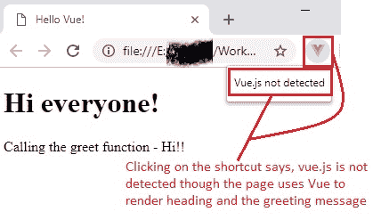

# 4\. Vue Devtools 设置

> 原文： [https://javabeginnerstutorial.com/vue-js/4-vue-devtools-setup/](https://javabeginnerstutorial.com/vue-js/4-vue-devtools-setup/)

警告：一旦发现如何使用 Vue Devtools 扩展，您将永远不会回到正常的世界。 通过提供用户友好的表示形式，调试变得非常容易。 不仅如此，在早期阶段安装它还将通过检查每个实例来帮助您了解 Vue 的工作原理，并加快整个学习和开发过程。 它可用作 Chrome 和 [Firefox](https://addons.mozilla.org/en-US/firefox/addon/vue-js-devtools/) 的浏览器扩展。

事不宜迟，让我们通过在 chrome 浏览器中安装 Vue devtools 来扼杀它。 让我们开始吧！

## 步骤 1：

访问 [chrome 网上商店](https://chrome.google.com/webstore/category/extensions)，然后在搜索栏中输入“`vue devtools`”。

点击显示的第一个建议“`vue devtools`”，或仅按“`Enter`”。

## 步骤 2：

点击“添加到 Chrome 浏览器”按钮，如下图所示。

您将看到一个弹出窗口，要求某些权限。 点击“添加扩展名”按钮进行确认。

### 步骤 3：

添加扩展名后，您会注意到一条确认消息以及一个小的快捷方式，如下所示。

瞧！ 您的 Chrome 浏览器中已安装 Vue Devtools ！！

让我们尝试启动一个页面，看看是否启用了此快捷方式。 换句话说，它变成了彩色？ 这表明正在检测到 Vue.js，我们可以开始使用它。 我正在 chrome 浏览器中打开我们刚刚安装了 devtools 扩展程序的[先前文章](https://javabeginnerstutorial.com/vue-js/3-vue-directives/)中讨论的[`index.html`文件](https://github.com/JBTAdmin/vuejs/blob/master/03_Introduction%20to%20Vue%20directives/index.html)。

如果快捷方式仍处于禁用状态，则不要惊慌，单击该快捷方式将显示“`Vue.js not found`”。

这是因为我们正在从系统中打开 HTML 文件，并且未将其部署在任何服务器上，即我们正在使用文件 URL。 只需看一下地址栏，您会发现地址以`file:///`开头。

解决此问题的简单方法是右键单击快捷方式，选择“管理扩展名”，然后打开“允许访问文件 URL”切换按钮。

现在，使用文件 URL 刷新页面，将按预期检测到 Vue.js。 要查看 Root 实例和数据对象，请打开 chrome 开发人员工具（按键盘上的`F12`），然后在 Vue 面板上单击。

完全不了解当前 Vue 面板中显示的所有内容绝对可以。 我们将讨论各个方面，并与他们合作。

再见，祝您有美好的一天！
