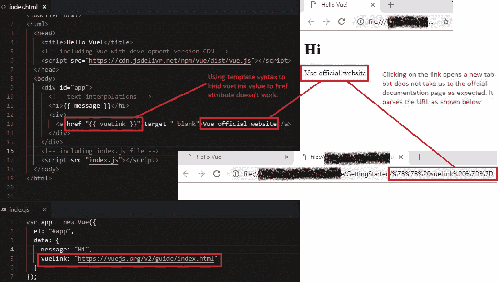
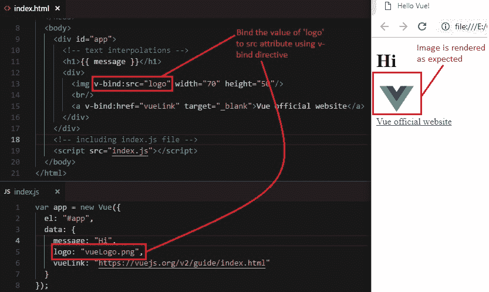
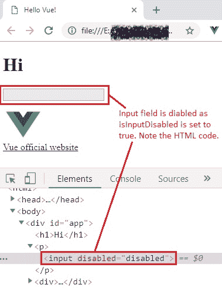
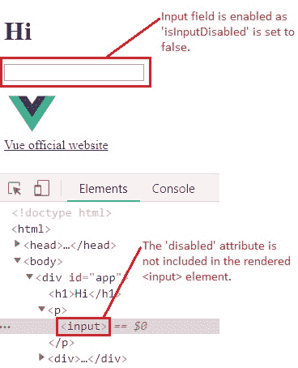

# 6.数据绑定第 2 部分（属性）

> 原文： [https://javabeginnerstutorial.com/vue-js/6-data-binding-p2/](https://javabeginnerstutorial.com/vue-js/6-data-binding-p2/)

在我们的[上一篇文章](https://javabeginnerstutorial.com/vue-js/5-data-binding-p1/)中，我给了您一些思考。 记得？ 属性绑定！ 是时候深入了解它了。 众所周知，示例有助于我们更轻松地理解概念。 那么，我们还等什么呢？

假设我们有一个锚标记，我们想将链接绑定到`href`属性。 让我们尝试使用文本插值技术（模板语法）来执行此操作，然后检查结果。



失望了吗？这是发生了什么事。 正如预期的那样，“Vue 官方网站”文本已显示为超链接。 单击它会打开一个新选项卡，因为我们使用了`_blank`作为目标（这里没什么疯狂的）。 现在，查看地址栏中的 URL。 不会像在 Vue 实例的数据对象中指定的那样导航到 [https://vuejs.org/v2/guide/index.html](https://vuejs.org/v2/guide/index.html) ，而是处理`href`属性的双引号内的值 作为字符串并解析为 URL `{{ vueLink }}`。 这就是普通 HTML `href`属性的工作方式，这就是您在新打开的标签页的地址栏中看到的内容。 显然，绑定从未发生过。

因此，这就是 Vue 的工作方式。 我们不能将模板语法/大括号括起来用于 HTML 属性绑定。 但是，如果我们仍然想将某些东西动态绑定到属性上怎么办？ 不要担心！ Vue 附带了另一个用于此目的的指令`v-bind`。 只要我们花时间寻找指令，指令就在我们周围。

在这种情况下，使用`v-bind`指令告诉 Vue.js 将`data`属性的值绑定到该指令后面的属性名称。

### 语法，

`v-bind:html_attribute=”data_to_be_bound`

### 示例，

`v-bind:href="vueLink"`

让我们尝试执行此代码并检查输出。


奇迹般有效！ 单击呈现的链接将打开一个新标签，该标签具有预期的指定链接。

## 其他示例场景

1.  在网页上动态显示图片，即，当在 Vue 实例的数据对象中更改图片位置时，应该在网页上自动更新图片。
2.  根据绑定到该字段的数据值启用或禁用输入字段。

让我们一次处理一种情况。 到最后，您将对 Vue.js 表现出超出预期的表现。

### 1.动态显示图像

让我们将 Vue 的徽标图像放置在与代码相同的文件夹中，并将其在数据对象中的位置指定为`logo`。 将``标记的`src`属性绑定到`logo`属性的值。

```html

```

图像将按预期渲染到 DOM。 将您的帽子戴上戒指，并尝试更改图像位置是否动态更新渲染的图像。 如果您在执行此操作时遇到任何挑战，请在评论部分给我大喊。 输出如下，



### 2.根据绑定的值启用或禁用输入字段

是时候做同样的歌舞了！

在 Vue 实例的数据对象中，让我们拥有`isInputDisabled`属性，并将其值设置为`true`

```javascript
isInputDisabled: true
```

让我们将其绑定到输入标签的`disable`属性。

```html
<input v-bind:disabled="isInputDisabled"/>
```

这会将禁用的属性绑定到所提到的属性的值，并禁用输入字段。 使用 Chrome 开发者工具检查该元素会显示其相应的 HTML 代码，如下所示，



现在让我们将`isInputDisabled`的值更改为`false`。

```javascript
isInputDisabled: false
```

有趣的是，如果禁用的属性值为`false`，`null`或`undefined`，则甚至不包含在呈现的`<input>`元素中（使用开发人员工具检查该元素）。



完整的代码如下，

### `Index.html`

```html
<!DOCTYPE html>
<html>
  <head>
    <title>Hello Vue!</title>
    <!-- including Vue with development version CDN -->
    <script src="https://cdn.jsdelivr.net/npm/vue/dist/vue.js"></script>
  </head>
  <body>
    <div id="app">
      <!-- text interpolations -->
      <h1>{{ message }}</h1>
      <p>
        <input v-bind:disabled="isInputDisabled"/>
      </p>
      <div>
        
        <br/>
        <a v-bind:href="vueLink" target="_blank">Vue official website</a>
      </div>
    </div>
    <!-- including index.js file -->
    <script src="index.js"></script>
  </body>
</html>
```

### `Index.js`

```javascript
var app = new Vue({
  el: "#app",
  data: {
    message: "Hi",
    isInputDisabled: false,
    logo: "vueLogo.png",
    vueLink: "https://vuejs.org/v2/guide/index.html"
  }
});
```

上面讨论的所有代码都可以在 [GitHub 仓库](https://github.com/JBTAdmin/vuejs)中找到。

启动您喜欢的 IDE，并编写一些自己的方案！ 如有任何疑问，请随时在“评论”部分中进行提问。 另一个有趣的概念很快见！
