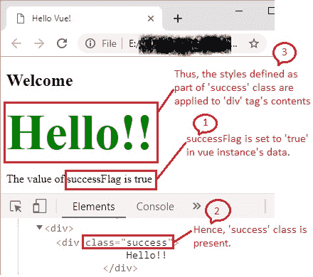
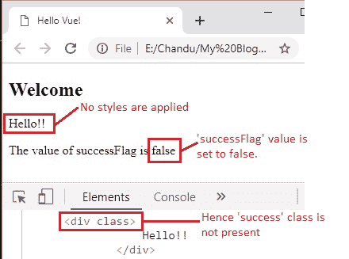
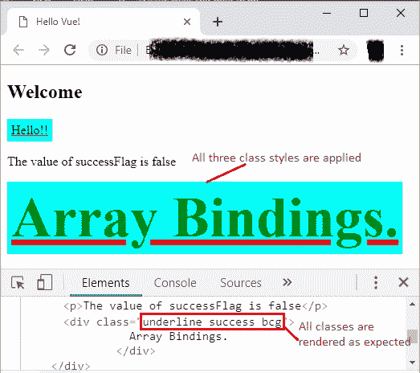

# 18.类绑定

> 原文： [https://javabeginnerstutorial.com/vue-js/18-class-bindings/](https://javabeginnerstutorial.com/vue-js/18-class-bindings/)

欢迎再次参加具有约束力的讨论。 今天，我将为您学习**类绑定**。 换句话说，我们将通过使用 Vue 将数据绑定到 HTML 元素的`class`属性来对其进行处理。 为什么？ 因为可能需要我们经常操作元素的类列表。 就像任何其他数据绑定一样，我们在此处也执行相同的歌曲和舞蹈，即强大的“`v-bind`”或其快捷方式“`:`”可用于处理这种情况。 表达式可以计算为**字符串，对象或数组**。

听起来令人困惑？ 别担心！ 在一些示例的支持下，让我们一次迈出一步。 您会立即看到自己冲刺！

## 初始代码：

index.html

```java
<!DOCTYPE html>
<html>
  <head>
    <title>Hello Vue!</title>
    <!-- including Vue with development version CDN -->
    <script src="https://cdn.jsdelivr.net/npm/vue/dist/vue.js"></script>
  </head>
  <body>
    <div id="app">
      <h2>Welcome</h2>
      <div> 
        <!-- OUR CODE GOES HERE -->
      </div>
    </div>
    <!-- including index.js file -->
    <script src="index.js"></script>
    <link rel="stylesheet" href="style.css"></link>
  </body>
</html>
```

index.js

```java
new Vue({
  el: "#app",
  data: {}
});
```

style.css

```java
<!-- LET US WRITE SOME CODE AS WE GO -->
```

## 对象语法

假设我们有一个名为“`success`”的类，其样式在`style.css`样式表中定义如下，

```java
.success {
  color: green;
  font-weight: bold;
  font-size: 70px;
}
```

使用 Vue，通过将其作为对象传递给`v-bind:class`来动态切换此类非常容易。

`index.html`（代码段）

```java
<div id="app">
  <h2>Welcome</h2>
  <div> 
  <!-- class bindings: Objects -->
  <div :class="{ success : successFlag }">
    Hello!!
  </div>
    <p>The value of successFlag is {{ successFlag }}</p>
  </div>
</div>
```

快捷方式`:`用于此处的指令`v-bind`。

`index.js`

```java
new Vue({
  el: "#app",
  data: {
    successFlag : true
  }
});
```

非常简单！ 我们有一个`div`标签，显示为“`Hello !!`”。 由于`data`属性的`successFlag`值为`true`，因此`div`标签中包含类`success`，并且其样式将应用于标签中的文本。



在浏览器中可以清楚地看到结果。 Chrome DevTools 窗格显示 HTML 代码中如何显示“`success`”类。

如果我们将`successFlag`的值设置为`false`，那么这就是输出的样子。

`index.js`（代码段）

```javascript
data: { 
  successFlag : false 
}
```



奇迹般有效！

如果我们拥有普通的`class`属性，并且在此属性之上，我们想借助`v-bind:class`来切换另一个类的存在？ 换句话说，我们可以在一个元素上同时具有`class`和`v-bind:class`吗？ 可能吗？

YESSSS！ 使用 Vue，几乎所有内容都是肯定的！

最好的部分是，我们可以通过**两种**方式实现这一目标。

### 方法 1：内联对象

`index.html`（代码段）

```html
<div> 
  <!-- class bindings: Objects -->
  <div class="underline" :class="{ success : successFlag, bcg : bcgFlag }">
    Hello!!
  </div>
  <p>The value of successFlag is {{ successFlag }}</p>
</div >
```

`index.js`（代码段）

```javascript
data: {
  successFlag: false,
  bcgFlag: true
}
```

`style.css`（代码段）

```css
.underline {
  text-decoration-color: red;
  text-decoration-line: underline;
}
.bcg {
  background-color: aqua;
  padding: 5px;
  width: fit-content;
}
```

普通的`class`属性具有将始终呈现的类`underline`。

还可能在对象中将更多字段传递给`v-bind:class`。 为了理解这一点，让我们根据其值的真实性切换两个类。 在上面的代码中，两个类`success`和`bcg`作为对象传递给`v-bind:class`。 `successFlag`和`bcgFlag`分别设置为`false`和`true`。 因此，呈现的类列表将变为“`underline bcg`”，并且仅应用那些样式。

### 方法 2：绑定非内联对象

`index.html`（代码段）

```html
<div class="underline" :class="classObject"> Hello!! </div>
```

`index.js`（代码段）

```javascript
data: {
  classObject: { 
    success : false, 
    bcg : true 
  }
}
```

在 vue 实例的数据中指定了要绑定到`v-bind:class`的对象。


## 数组语法

可以使用类以数组的形式将类传递给`v-bind:class`，而不是使用对象，

`index.html`（代码段）

```html
<!-- class bindings: Arrays -->
<div class="underline" :class="[successClass, bcgClass]">
  Array Bindings.
</div>
```

`index.js`（代码段）

```javascript
data: {
  successFlag: false,
  bcgFlag: true,
  successClass: 'success',
  bcgClass: 'bcg'
}
```

为简单起见，本示例也使用相同的类。

在 chrome DevTools 中检查时，这将呈现所有三个类，

`<div class="underline success bcg">`



上面讨论的所有代码都可以在 [GitHub 仓库](https://github.com/JBTAdmin/vuejs)中找到。

启动您喜欢的 IDE，并编写一些自己的方案！ 如有任何疑问，请随时在“评论”部分中进行提问。 请继续关注，因为我们的下一篇文章都是关于绑定内联样式的。
