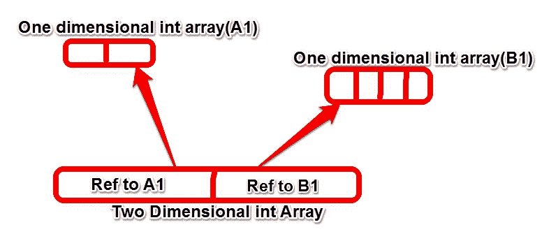

# Java 数组教程

> 原文： [https://javabeginnerstutorial.com/core-java-tutorial/java-array-tutorial/](https://javabeginnerstutorial.com/core-java-tutorial/java-array-tutorial/)

Java 数组是一种数据结构类型，用于存储相同类型的多个变量。 数组可以包含基元和对象。 数组中的变量是有序的，但未排序。 数组中的每个元素都有一个索引，数组中元素的起始索引为 0。

> 数组将始终是堆中的对象。 不管它存储什么，基元还是对象。

## 数组声明（语法）

### 原始数组

```java
 //Single Dimensional Array
		int[] arr;  //recommended
		int arr[];

		//Multi Dimensional Array
		int[][] arr;  //recommended
		int arr[][];
		int[] arr[];Array Of Objects
```

### 对象数组

```java
 //Single Dimensional Array
		String[] arr; //recommened
		String arr[];

		//Multi Dimensional Array
		String[][] arr; //recommened
		String arr[][];
		String[] arr[];
```

##### 注意：您不能在声明中包括数组的大小。

> 声明仅不会在堆中创建数组对象。

## 构造一个 Java 数组

这是将在堆上创建数组对象的步骤。 一旦创建，就无法更改数组的大小，因此在构造数组时需要提供数组的大小。 JVM 在堆上创建数组对象时将使用此大小。

> 数组的大小意味着一个数组可以包含多少元素。

### 一维数组

new 关键字将用于构造一维/多维数组。

```java
 int[] arr; //declares a new array
		arr = new int[10]; One Dimensional Array
```

### 二维数组

这些是数组的数组。 因此，二维数组是`int`数组的数组。 因此，当您说的时候，您将创建一个`Long`类型的二维数组，这意味着它将是一个包含多个元素的数组，这些元素本身就是`Long`类型的数组。 



```java
 int[][] arr;
		arr = new int[10][];
```

> 仅第一部分（*第一维*）需要大小，而不需要全部。

## 初始化数组

一旦创建了数组并为其分配了空间，下一步将是在其中添加元素。 数组的初始化是我们可以执行此操作的地方（在数组中添加元素）。

### 一维数组

```java
 int[] arr  = new int[10];
		arr[0] = 0;
		arr[0] = 1;
		int[][] arr  = new int[10][]; //   Multi Dimensional Array   
		arr[0][0] = 0;
		arr[0][1] = 1;
```

## Java 数组字面值

在 Java 中，如果您要创建基本类型或字符串的数组并且值是固定的，则可以利用数组字面值的语法。 这是定义数组字面值的方法。

```java
String[] strArray = new String[]{"J", "B", "T"};

String[] strArray = {"J", "B", "T"};
```

`{}`用于定义需要在数组中插入的值。 `{}`中的值将确定数组的大小。

## 访问数组元素

数组中的每个元素都有一个索引。 索引**从 0** 开始，这意味着数组中的第一个元素的索引为 0，第二个元素的索引为 1。这些索引号可用于访问数组中的特定元素。 相同的索引可用于在给定索引处设置数组中的值。

```java
String[] strArray = {"J"，"B"，"T"};
strArray[0] = "CHANGED";
String valueAtIndex = strArray[0];
```

数组中的最后一个元素的索引号为（`size_of_the_array – 1`）。

## Java 数组备忘单

*   数组是相同类型的变量的集合。
*   数组始终在堆中创建。
*   数组可以包含基本体和对象。
*   数组的大小不能包含在声明中。
*   该声明不会在堆中创建数组对象。
*   创建数组后，其大小无法更改。
*   可以通过长度字段访问数组的长度。
*   Java `for`循环或增强循环可用于迭代数组元素。

数组示例

```java
public class JavaArrayBasic {

	public static void main(String args[]) {

		/*
		 * Array needs to be initialized before it can be used
		 */
		int intArr[] = { 1, 2 };
		int intArr1[];

		// intArr1 can not be used @ this place as it has not been initialized yet

		/*
		 * intArr = {1,2}; Array constants can only be used in initializers, So
		 * above line will give compile time error
		 */

		for (int i = 0; i < 2; i++)
			System.out.println("Value in array @ index" + i + " is "
					+ intArr[i]);

	}
}
```

