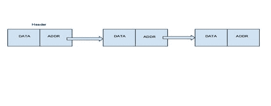

# 链表

> 原文： [https://javabeginnerstutorial.com/data-structure/linked-list/](https://javabeginnerstutorial.com/data-structure/linked-list/)

## 什么是链表？

链表是另一种数据结构，也是一种常见的数据结构，它包括按顺序分为两组的一组节点，每个节点由数据和下一个节点的地址部分组成，并形成一个链。 它用于创建树和图。



**优点**

*   本质上是动态的，并在需要时分配内存。
    
*   有两个可以在链表中轻松实现的操作，即插入和删除。
    
*   减少访问时间。
    

**缺点 **

*   内存浪费了，因为指针需要额外的存储空间。
    
*   该元素不能随机访问，可以顺序访问。
    
*   在链表中，反向遍历很困难。
    

## 在哪里使用链表？

1.  它们用于实现栈，队列，图形等。

2.  它们使您可以在列表的开头和结尾插入元素。

3.  在此不需要事先知道大小。

## 链表的类型

### 单链表

这种类型的列表包含具有数据部分和地址部分的节点，即`next`，它指向给定节点序列中的下一个节点。 我们可以对单链列表执行的操作包括插入，删除和遍历。


### 双链表

在这种类型的列表中，每个节点包含两个链接，第一个链接将指向序列中的上一个节点，下一个链接将指向序列中的下一个节点。

 

循环链表 - 在这种类型的列表中，列表的最后一个节点包含第一个节点的地址，并将形成一个循环链。
    

    

## 单链表

单链表是其中每个节点仅包含一个指向下一个节点的链接字段的列表。 在这种情况下，节点分为两部分，第一部分是数据部分，另一部分是包含下一个节点地址的链接部分。 第一个节点是标头节点，其中包含下一个节点的数据和地址，依此类推。 单链列表也称为单向列表，因为它只能从左到右遍历，而另一种方式则是不可能的。


  


### 在哪里使用单链表？

单链列表可以在使用后进先出概念的栈中使用。 此列表维护与列表中头节点的链接，每个节点都指向列表中的下一个节点。 它也可以用于先入先出的队列中。

**在 C 中实现单链表**

```c
#include<stdio.h>
#include<stdlib.h>
typedef struct Node
{
        int data;
        struct Node *next;
}node;
void insert(node *ptr, int data)
{
        while(ptr->next!=NULL)
        {
                ptr = ptr -> next;
        }

        ptr->next = (node *)malloc(sizeof(node));
        ptr = ptr->next;
        ptr->data = data;
        ptr->next = NULL;
}
int find(node *ptr, int key)
{
        ptr =  ptr -> next;

        while(ptr!=NULL)
        {
                if(ptr->data == key)
                {
                        return 1;
                }
                ptr = ptr -> next;
        }

        return 0;
}
void delete(node *ptr, int data)
{

        while(ptr->next!=NULL && (ptr->next)->data != data)
        {
                ptr = ptr -> next;
        }
        if(ptr->next==NULL)
        {
                printf("Element %d is not present in the list\n",data);
                return;
        }
     
        node *temp;
        temp = ptr -> next;
        ptr->next = temp->next;
        free(temp);

        return;
}
void print(node *ptr)
{
        if(ptr==NULL)
        {
                return;
        }
        printf("%d ",ptr->data);
        print(ptr->next);
}
int main()
{
        node *start,*temp;
        start = (node *)malloc(sizeof(node));
        temp = start;
        temp -> next = NULL;

        printf("1. Insert\n");
        printf("2. Delete\n");
        printf("3. Print\n");
        printf("4. Find\n");
        while(1)
        {
                int option;
                scanf("%d",&option);
                if(option==1)
                {
                        int data;
                        scanf("%d",&data);
                        insert(start,data);
                }
                else if(option==2)
                {
                        int data;
                        scanf("%d",&data);
                        delete(start,data);
                }
                else if(option==3)
                {
                        printf("The list is ");
                        print(start->next);
                        printf("\n");
                }
                else if(option==4)
                {
                        int data;
                        scanf("%d",&data);
                        int result = find(start,data);
                        if(result)
                        {
                                printf("The element is found \n");
                        }
                        else
                        {
                                printf("The element is not found\n");

                        }
                }
        }


}
```

## 双链表

双链列表也称为双向列表或双向链。 在双向链表中，两个链接字段被保留，而不是像在单个链表中那样保留一个链接字段。 双链表是一个线性数据结构，其中每个节点都有两个链接，其中第一个链接用于指向前一个节点，下一个链接指向下一个节点。 在双向链表上执行的操作是插入，删除，搜索和遍历。


### 在哪里使用双链表？

1.  用于表示游戏中的纸牌。
    
2.  在具有“最近使用”列表的应用中使用。
    
3.  在 Word 或 Photoshop 中用作撤消功能。
    
4.  在浏览器缓存中使用，它使我们可以单击后退按钮。
    

**使用 C 实现双向链表**

```c
#include<stdio.h>
#include<stdlib.h>
typedef struct Node
{
        int data;
        struct Node *next;
        struct Node *prev;
}node;
void insert(node *ptr, int data)
{
       
        while(ptr->next!=NULL)
        {
                ptr = ptr -> next;
        }
       
        ptr->next = (node *)malloc(sizeof(node));
        (ptr->next)->prev = ptr;
        ptr = ptr->next;
        ptr->data = data;
        ptr->next = NULL;
}
int find(node *ptr, int key)
{
        ptr =  ptr -> next;
     
        while (ptr!=NULL)
        {
                if(ptr->data == key)
                {
                        return 1;
                }
                ptr = ptr -> next;
        }
       
        return 0;
}
void delete(node *ptr, int data)
{
       
        while(ptr->next!=NULL && (ptr->next)->data != data)
        {
                ptr = ptr -> next;
        }
        if(ptr->next==NULL)
        {
                printf("The element %d is not present in the list\n",data);
                return;
        }
       
        node *temp;
        temp = ptr -> next;  
        ptr->next = temp->next;
        temp->prev =  ptr;
        free(temp);
        return;
}
void print(node *ptr)
{
        if(ptr==NULL)
        {
                return;
        }
        printf("%d ",ptr->data);
        print(ptr->next);
}
int main()
{
        node *start,*temp;
        start = (node *)malloc(sizeof(node));
        temp = start;
        temp -> next = NULL;
        temp -> prev = NULL;

        printf("1. Insert\n");
        printf("2. Delete\n");
        printf("3. Print\n");
        printf("4. Find\n");
        while(1)
        {
                int option;
                scanf("%d",&option);
                if(option==1)
                {
                        int data;
                        scanf("%d",&data);
                        insert(start,data);
                }
                else if(option==2)
                {
                        int data;
                        scanf("%d",&data);
                        delete(start,data);
                }
                else if(option==3)
                {
                        printf("The list is ");
                        print(start->next);
                        printf("\n");
                }
                else if(option==4)
                {
                        int data;
                        scanf("%d",&data);
                        int result = find(start,data);
                        if(result)
                        {
                                printf("The element is found\n");
                        }
                        else
                        {
                                printf("The element is not found\n");

                        }
                }
        }


}
```

## 循环链表

循环链表是有点复杂的链接数据结构。 在此列表中，我们可以在列表中的任何位置插入元素，而在数组中，我们不能在列表中的任何位置插入元素，因为它在连续内存中。 在此列表中，上一个元素存储下一个元素的地址，最后一个元素存储第一个元素的地址。 列表中的元素以圆形的方式相互指向，形成圆形的链。 该列表具有动态大小，这意味着可以在需要时分配内存。


### 在哪里使用循环链表？

使用此列表的实际应用是在其上运行多个应用的​​PC。 循环链表在操作系统中很常见，因为它会将正在运行的应用放在列表中，并且当列表即将到达其末端时，操作系统很容易使用循环链表，因为操作系统可以循环运行 在列表的最前面。 将该时隙分配给列表中的每个应用。

**在 C 中实现循环链​​表**

```c
#include<stdio.h>
#include<stdlib.h>
struct node
{
        int data;
        struct node *next;
}node;
void insert(node *pointer, int data)
{
        node *start = pointer;
        while(pointer->next!=start)
        {
                pointer = pointer -> next;
        }
        pointer->next = (node *)malloc(sizeof(node));
        pointer = pointer->next;
        pointer->data = data;
        pointer->next = start;
}
void delete(node *pointer, int data)
{
        node *start = pointer;
        while(pointer->next!=start && (pointer->next)->data != data)
        {
                pointer = pointer -> next;
        }
        if(pointer->next==start)
        {
                printf("Element %d is not present in the list\n",data);
                return;
        }
        node *temp;
        temp = pointer -> next;
        pointer->next = temp->next;
        free(temp);
                   free( )
          return;
}
void display(node *start,node *pointer)
{
        if(pointer = = start)
        {
                return;
        }
        printf("%d ",pointer->data);
        display(start,pointer->next);
}
void main()
{
        node *start,*temp;
        start = (struct node *)malloc(sizeof(struct node));
        temp = start;
        temp -> next = start;
        printf("1. Insert\n");
        printf("2. Delete\n");
        printf("3. Display\n");
        while(1)
        {
                int query;
                scanf("%d",&query);
                if(query==1)
                {
                        int data;
                        scanf("%d",&data);
                        insert(start,data);
                }
                else if(query==2)
                {     int data;
                        scanf("%d",&data);
                        delete(start,data);
                }
                else if(query==3)
                {      printf("The list is ");
                        display(start,start->next);
                        printf("\n");
                }        }
getch( );
}
```

## 线性链表

在链表中，我们可以通过三种方式插入元素：

*   插入列表的开头。
    
*   插入列表的中间。
    
*   插入到列表的末尾。
    

在将节点插入列表之前，我们将使用关键字`struct`创建一个结构。 例如：

```c
struct node

{ int data;

struct node *next;

};

struct employee *start=NULL, *temp,*q;
```

并且在定义了结构之后，在从列表中插入或删除节点的同时，给出了特定的功能定义或功能原型。 例如：

```c
void insertbeg( );

void insertmiddle( );

void insertlast( );

void deletebeg( );
```

上面给出的函数定义在`main`函数之前定义，即`void main()`或`int main()`。

**在开头的插入元素**

在开始时插入节点的步骤：

1.  创建一个新节点。
    
2.  在数据部分输入数据。
    
3.  将地址部分或下一部分设为`NULL`。
    
4.  现在将这个新创建的节点附加到起始或头部。
    
5.  现在，将此起始节点设为起始节点或标头节点。
    

**在中间的插入元素**

在中间插入节点的步骤：

1.  将要添加的新节点的数据写入列表及其位置。
    
2.  通过调用`malloc()`创建一个新的空节点。
    
3.  将数据插入新节点的数据部分。
    
4.  将此新节点添加到列表中的所需位置。
    
5.  转到步骤 1，直到您在列表中添加了所有值。
    

**实现**

```c
void insertmiddle()

{ int pos,i,num;

if(start==NULL)

{ printf("\nList is empty!! Sorry...");

}

temp=(struct node*)malloc(sizeof(struct node));

printf("\nEnter the details:");

scanf("%d",num);

printf("\nEnter position:");

scanf("%d",&pos);

temp->data=num;

q=start

for(i=1;i<pos-1;pos++)

{

if(q->next==NULL)

{ printf("\nLess elements in the list");

}

q=q->next;

}

temp->next=q->next;

q->next=temp;

getch();

}
```

**在列表的末尾插入元素：**  


最后插入节点的步骤：

1.  创建新节点。
2.  将数据输入到节点的数据部分。
3.  将节点的下一部分设为`NULL`。
4.  要在最后一个位置插入节点，因此我们必须遍历到最后一个节点。
5.  在最后一个节点和新节点之间建立链接。

**实现**

```c
void insertlast()

{ int num;

temp=(struct node*)malloc(sizeof(struct node));

printf("\nEnter the details:");

scanf("%d",&num);

temp->data=num;

temp->next=NULL;

if(start==NULL) //If list is empty

{

start=temp;

}

else

{

q=start;

while(q->next!=NULL)

q=q->next;

q->next=temp;

}
}
```

**删除**

可以通过三种方式删除该元素：

*   从列表的开头删除。
    
*   从列表的中间删除。
    
*   从列表末尾删除。
    

**从开头删除元素**

```c
Implementation

void deletebeg()

{ if(start==NULL)

{ printf("\nThe list is empty...");

}

else

{

q=start;

start=start->next;

free(q);

printf("\nElement deleted...");

}

}
```

**从中间删除元素**

实现

```c
void deletemiddle()

{ int pos,i;

if(start==NULL)

{ printf("\nThe list is empty...");

}

printf("\nEnter position to delete:");

scanf("%d",&pos);

for(i=1;i<pos-1;pos++)

{

if(q->next==NULL)

{

printf("\nLess elements...");

getch();

}

q=q->next;

}

temp=q->next;

q->next=temp->next;

free(temp);

printf("\nElement deleted...");

getch();

}
```

**从末尾删除元素**

实现

```c
void deletelast()

{ if(start==NULL)

{

printf("\nThe list is empty...");

}

else

{

q=start;

while(q->next->next!=NULL)

q=q->next;

temp=q->next;

q->next=NULL;

free(temp);

printf("\nElement deleted...");

}

}
```

**显示**

在执行任何操作后显示列表的元素。

```c
void display()

{ struct node *q;

q=start;

while(q!=NULL)

{

printf("%d\t",q->data);

q=q->next;

}

getch();

}
```