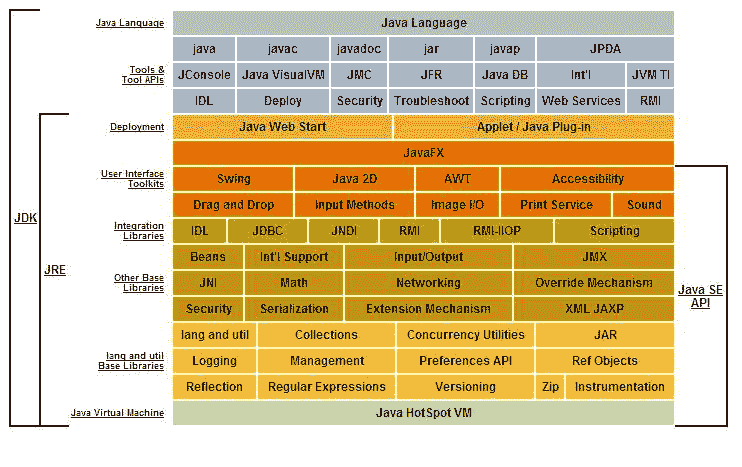

# jdk vs jre vs jvm

> 原文： [https://javabeginnerstutorial.com/core-java-tutorial/jdk-vs-jre-vs-jvm/](https://javabeginnerstutorial.com/core-java-tutorial/jdk-vs-jre-vs-jvm/)

为了了解JDK vs JRE vs JVM。 您需要首先了解每个术语。 因此，我们首先定义JDK（Java开发工具包），JRE（Java运行时环境）和JVM（Java虚拟机）。

## JDK（Java开发套件）

JDK包含 ***开发和运行*** Java应用程序所需的所有内容。

## JRE（Java运行时环境）

JRE包含 ***运行*** 已编译的Java应用程序所需的所有内容。 它不包含开发Java应用程序所需的代码库。

## JVM（Java虚拟机）

JVM是一种虚拟机，可在您的操作系统上运行，为编译后的
Java代码提供推荐的环境。 JVM仅适用于字节码。 因此，您需要编译Java应用程序（.java），以便可以将其转换为字节码格式（也称为.class文件）。

然后，JVM将使用它来运行应用程序。 JVM仅提供执行Java字节码所需的环境。

## JDK vs JRE vs JVM

下表显示了每种Java技术的不同功能。

 *图片提供：Oracle Corporation

现在，根据该图，您可以确定有什么区别。

JRE = JVM +运行应用程序所需的库。

JDK = JRE +开发Java应用程序所需的库。

### Java可移植性

为了理解Java的可移植性，您需要从头到尾了解Java代码会发生什么。

*   Java源代码（由开发人员编写）（机器中性）
*   编译代码/字节码（由javac编译）。 （机器中性）
*   执行的字节码（由JVM执行）（特定于机器）

在步骤2中，javac（Java编译器）将Java代码转换为字节码。 可以将其移动到任何计算机（Windows / Linux）并由JVM执行。 JVM读取字节码并生成机器特定的代码。 为了生成特定于机器的代码，JVM需要特定于机器。 因此，每种类型的计算机（Windows / Linux / Mac）都具有特定的JVM。 因此，编码器
无需费心生成字节码。 JVM负责可移植性。 因此，最终的答案是Java是可移植
，而JVM是特定于机器的。

<noscript><iframe allow="accelerometer; autoplay; encrypted-media; gyroscope; picture-in-picture" allowfullscreen="" frameborder="0" height="360" src="https://www.youtube.com/embed/RJ5NLb2zLhw?start=5&amp;feature=oembed" title="JDK vs JRE vs JVM" width="640"></iframe></noscript>

###### 下一篇文章

##### [public static void main（string args []）说明](https://javabeginnerstutorial.com/core-java-tutorial/public-static-void-mainstring-args-explanation/ "public static void main(string args[]) Explanation")