# 7D Selenium IDE – 了解您的 IDE 功能

> 原文： [https://javabeginnerstutorial.com/selenium/7d-know-ide-features/](https://javabeginnerstutorial.com/selenium/7d-know-ide-features/)

欢迎回到*魔术草地*！ 今天，我们将深入了解在我之前的文章“[打破表面：初看起来](https://javabeginnerstutorial.com/selenium/7c-selenium-ide-first-look/)”的帮助下安装的 Selenium IDE 的功能。

作为参考，我将粘贴一段时间后看到的第一张图片，

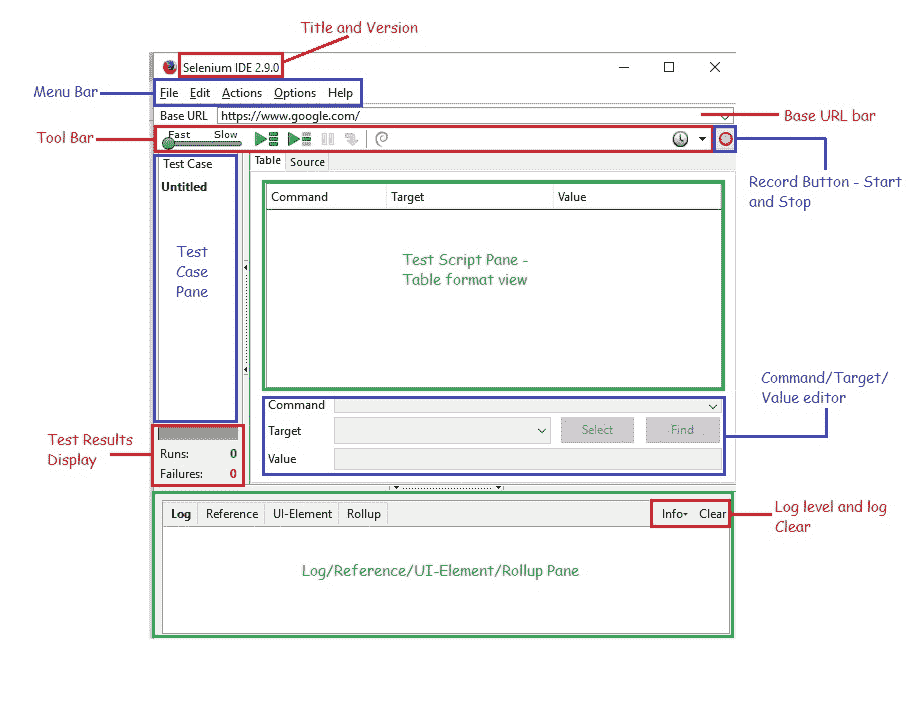

## 菜单栏

菜单栏有五个组件，即文件，编辑，操作，选项和帮助。 让我们专注于我们将经常使用的那些。

*a. 文件菜单*

*   “文件”菜单用于创建，打开，保存，导出，关闭测试用例和测试套件。
*   也可以查看最近使用的测试用例/测试套件文件。
*   默认情况下，测试以 HTML 格式保存。
*   这里最方便我们使用的最佳选项是“**将测试用例导出为…**”和“**将测试用例导出为…**”，因为它们使我们可以转换自动 Selenium 测试用例 将 IDE 转换为可以直接在 Selenium 远程控制或 WebDriver 中使用的格式组合（编程语言/单元测试框架/ Selenium 框架）。 我们将继续进行介绍。

下面是文件菜单的快照，其中“导出测试用例为...”选项已展开。

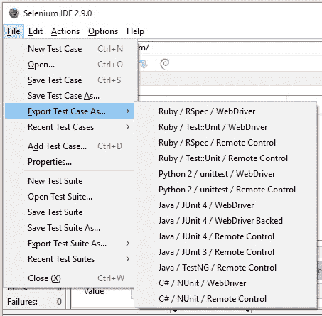

如您所见，使用 Selenium IDE 2.9.0 版，我们可以在 **Ruby，Python 2，C# 和 Java** 语言中导出当前打开的测试用例，及其相应的单元测试框架。

*b. 编辑菜单*

*   编辑菜单使我们可以撤消，重做，剪切，复制，粘贴，删除和全选命令。
*   此菜单中值得记住的选项是“**插入新命令**”和“**插入新注释**”。
*   “插入新命令”将允许用户在当前所选命令的顶部顶部插入新命令。
*   “插入新评论”将允许用户在当前所选行的顶部上添加新评论。 这对于文档目的非常有用。

这是为您提供的“编辑”菜单，

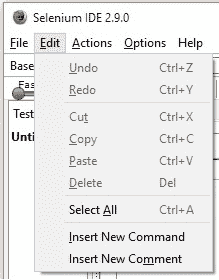

是时候换另一个相关的 **BrainBell** 了！ 使用我们已经知道的东西来关联我们正在学习的内容，可以帮助大脑更轻松地记住。 就像在大脑上贴笔记一样。

因此，这里是我们著名的诗，但稍作修改，

> 玫瑰是红色
> 紫色是蓝色
> （在 Selenium IDE 中）
> **命令**是**黑色** &
> **注释**是**紫色**！

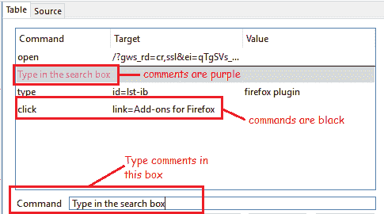

如果您认为自己可以做得更好，请继续尝试。 随时欢迎您在评论部分中发表您的想法和想法。

*c. 动作菜单*

为了更好地理解和可视化，从菜单快照开始，

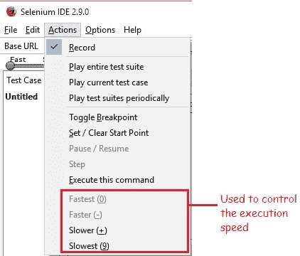

*   “操作”菜单允许我们在处理测试用例时执行一些操作，例如记录浏览器操作，播放选定的测试用例/测试套件等。
*   通过在测试用例的任何执行步骤中设置一个或多个断点，在调试中使用“**切换断点**”。 这有助于强行中断执行。
*   “**设置/清除起点”** 用于设置或清除任何测试步骤的起点。 因此允许我们从设置的起点开始执行。
*   可以使用“**执行此命令**”来选择并执行特定命令。

*d. 选项菜单*

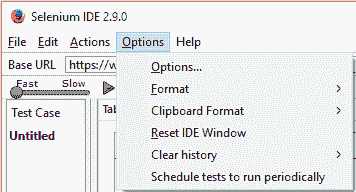

*   选项菜单是最重要的菜单之一，因为它使我们能够配置 Selenium IDE 工具的各种预定义设置。

让我们一一看。 首先单击“**选项…**”，将打开“Selenium IDE 选项”对话框，如下所示：

在**常规**标签中：

*   **默认超时值** – 这表示 Selenium IDE 在产生错误之前宁愿等待测试步骤执行的时间（以毫秒为单位）。 默认值设置为 30000ms，即 30s。 可以根据 Web 元素出现或可访问的速度适当增加或减少此值。
*   **扩展** – Selenium IDE 扩展增强了该工具的功能，可以通过从[下载所需的扩展来实现此功能 https://addons.mozilla.org/en-US/firefox /](https://addons.mozilla.org/en-US/firefox/) 链接，在页面右上角的搜索框中使用“Selenium”作为关键字。 除了作为基准 IDE 扩展的一部分定义的扩展之外，这些还将是其他扩展。
*   **记住基本 URL** – 选中此选项将确保 Selenium IDE 每次启动时都会记住该 URL 或将其加载到该工具的基本 URL 文本框中。 取消选中此选项后，IDE 将在基本 URL 栏中以空白值启动。
*   **启用实验性功能** – 首次使用活动的互联网连接检查此字段将导入可用的格式，我们将在稍后看到。

**格式**选项卡：

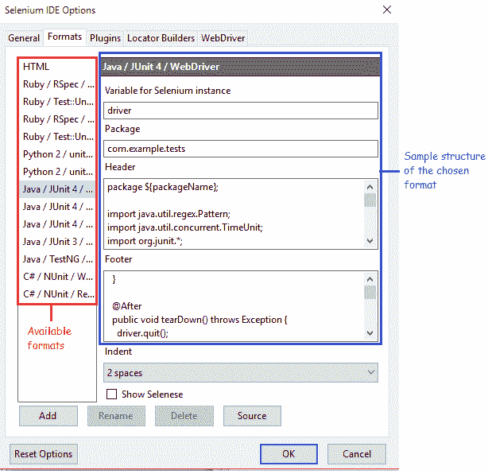

此选项卡显示 Selenium IDE 中的可用格式以及所选格式的示例 结构体。 用户可以轻松地添加/重命名/删除任何可用格式。

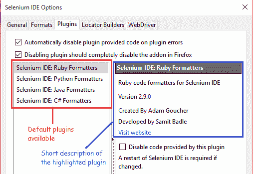

“插件”选项卡显示该工具可用的默认插件。 提供了许多插件，可以轻松下载和安装。 有几个这样的例子，

1.  “Selenium IDE：PHP 格式化程序” – 用于将 HTML 测试用例转换为 PHP 格式
2.  “文件日志” – 将生成的日志保存到文件

**定位器构建器**选项卡，

**定位器**是 Selenium 在网页上唯一地定位或标识 Web 元素的一种方式。 例如，在记录一个测试用例时，如果我们单击一个 Web 元素，Selenium 将立即查找其“ui”属性以存储其位置，因为列表中首先提到了该属性。 如果“`ui`”不可用，它将查找“`id`”，因为它在列表中排第二。 一直进行到找到所单击元素的唯一定位器为止。 因此，此列表列出了在重新编码时优先确定定位器生成顺序的方法。 只需在左窗格中进行简单拖放，即可根据需要更改顺序。

其次，在“选项”菜单中有“**格式**”：

格式选项显示可以将 Selenium IDE 测试用例转换成的可用格式。 HTML 是选择的默认格式。 格式提供了将所选测试用例转换为的编程语言/单元测试框架/套件中可与代码一起使用的工具的组合。

第三个重要选项之一是“**剪贴板格式**”。 参见下图，

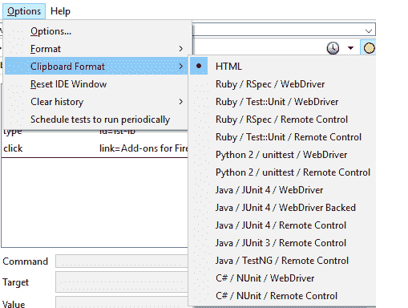
这看起来与我们刚刚看到的“**格式**”选项非常相似。 从测试脚本窗格复制命令时，剪贴板格式可帮助我们选择希望粘贴时显示代码段的格式。 HTML 也是此处的默认选择。

*e. 帮助菜单*

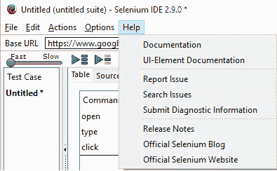

帮助始终适用于 Selenium，因为它具有广泛的社区和用户基础。 此选项使我们可以报告问题，搜索问题，仔细阅读可用的文档，查看发行说明，官方博客和网站； 从而提供了大量信息。

## 基本网址栏

这是一个下拉列表，用于记住所有以前访问的 URL，以便于访问。 它类似于我们在网页中看到的地址栏中的 URL。

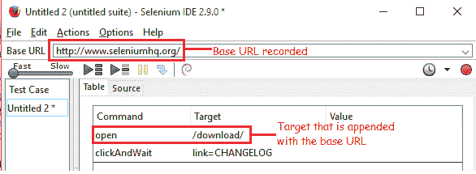

带有空白目标的“打开”命令将导航至基本 URL 栏中指定的 URL。

鉴于如上图所示，如果将“打开”命令与“`/download/`”之类的目标一起使用，Selenium IDE 将带我们进入 [https://www.seleniumhq.org/download/](https://www.seleniumhq.org/download/) 页面 。 因此，目标被附加到指定的基本 URL。 因此，这在相对 URL 的情况下非常有用。

为了不使这篇文章太长，让我们休息一下，一旦您回来，请单击下一篇文章“[继续了解您的 Selenium IDE 功能](https://javabeginnerstutorial.com/selenium/ide-know-ide-features-contd/)”。

再见。 祝大家有美好的一天！

