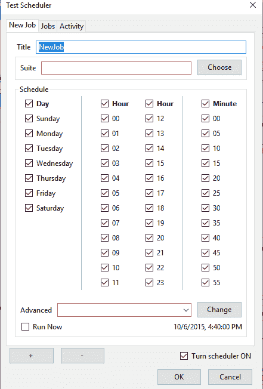
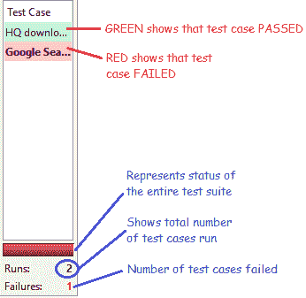
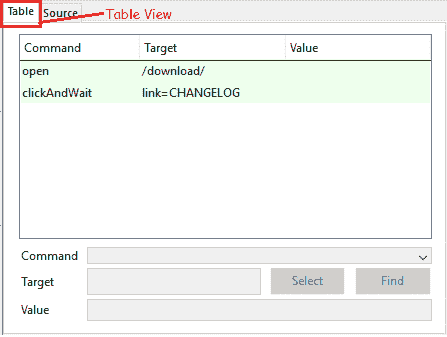
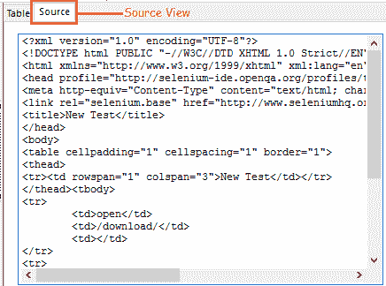
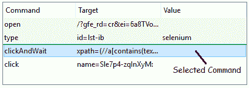
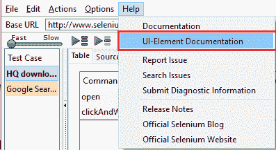

# 7E Selenium IDE – 了解您的 IDE 功能（续）。

> 原文： [https://javabeginnerstutorial.com/selenium/ide-know-ide-features-contd/](https://javabeginnerstutorial.com/selenium/ide-know-ide-features-contd/)

休息后欢迎回来。 猜猜您已经准备好继续我们的功能探索。 所以，我们开始！

## 工具列

Selenium IDE 提供了一个非常简单但有用的工具栏，可用于记录，播放，暂停，逐步和安排测试 点击。 是时候深入了解了……

 

*回放速度*：允许控制所选测试用例/测试套件的执行速度。

 

*播放整个测试套件*：允许顺序播放属于一个测试套件的所有测试用例。

 

*播放当前测试用例*：允许播放在左侧的“测试用例”窗格中当前选择的测试用例。

 

*播放当前测试用例*：允许播放在左侧的“测试用例”窗格中当前选择的测试用例。

 

*步骤*：帮助逐步进入测试脚本中的每个命令，并且一次只能执行测试用例的一个步骤。 这在调试测试时很方便。

 

*汇总*：允许组合 Selenese 命令的重复序列并将其作为单个动作执行。 它是此工具的高级功能。

 

*测试调度器*：允许我们根据需要设置测试计划规则。 此选项可以打开或关闭。

    

单击该图标将弹出“测试调度器”窗口，如上所示。 可以提供职位名称。 可以通过单击适当的日期，小时，分钟。 提供高级选项，例如每小时，每 5 分钟等。

 

*记录*：用于开始/停止用户浏览器动作的记录。 在中央的测试脚本窗格中，每个动作均作为 Selenese 命令输入。 空心的红色圆圈表示该工具正在记录，而此处所示的实心圆圈表示记录已结束。 默认情况下，在启动 IDE 时，它处于记录模式。

## 测试用例窗格

Selenium IDE 工具的左侧有一个测试用例窗格，如下所示，

*   它显示了当前打开的测试用例的数量。
*   当前选择的测试用例以粗体显示。
*   可以打开多个测试用例。
*   打开测试套件将自动打开并列出与之相关的所有测试用例。
*   一旦执行了这些测试，它们就会用颜色编码。 绿色表示测试用例通过，红色表示失败。
*   测试结果显示在底部。 栏中的颜色表示整个测试套件的通过/失败状态。 还显示了运行的测试案例总数和失败的测试案例数量。

## 测试脚本窗格（或）编辑器

此部分显示记录的测试用例的脚本。 每个动作将按照在浏览器中执行的顺序记录和显示。 有两种观点。 表视图和源视图。

**a. 表格检视**：

*   这是启动 IDE 时将打开的默认视图。
*   它以可读的表格格式显示命令及其参数。
*   执行测试用例时，每个步骤都用绿色或红色进行颜色编码。
*   可以使用下面的“命令/目标/值”部分插入和编辑命令。 整个博客都专门介绍了这一部分。

**b. 资料来源检视**：

*   这显示了测试用例的保存格式。
*   默认情况下显示 HTML 格式。
*   其他编程语言（例如 C# ，Java，Ruby，Python）也可以借助菜单栏中的“选项”标签来选择。
*   源代码视图还可以帮助以原始格式编辑脚本以及剪切，复制和粘贴选项。

## 日志/参考/ UI 元素/汇总窗格

该窗格具有四个功能。 根据选择的选项卡，执行其相应的功能。

**a. 日志窗格**

*   即使未选择“日志”选项卡，这也是显示的默认窗格。
*   在执行测试用例时，将在运行时中显示信息和错误消息。
*   这些用于调试测试用例。
*   clear 选项用于清除到目前为止生成的日志。
*   信息选项是一个下拉菜单，其中有四个选项-调试，信息，警告和错误。
*   通过选择我们的日志记录级别，可以过滤特定级别的消息。 下面显示了过滤错误消息的示例。

*   **调试**：提供有关 Selenium IDE 在后台执行的操作的技术信息，例如 称为函数，加载外部 JavaScript 文件等。
*   **信息**：提供有关当前正在执行的命令的信息。
*   **警告**：在极少数情况下显示警告消息，例如无效的参数/意味着较少的条件等。
*   **错误**：在执行导致无法通过的测试用例期间发生错误时显示的消息。 如果同样不满足“断言”和“验证”命令中提到的条件，则会生成错误。

**b. 参考窗格**

它显示了当前所选命令的说明以及所需目标和值的说明。

这些图像显示了所选命令“点击并等待”的参考。

**c. UI 元素窗格**

该窗格对 Selenium IDE 的高级用户最有用。 为了定位元素并标识其映射，使用 JSON（JavaScript 对象表示法）。 详细的文档位于“UI 元素文档”选项下的“帮助”菜单中。

**d. 汇总窗格**

这也是该工具的高级功能。 关于此方面的详细信息，可在“帮助”菜单下的同一“UI 元素文档”选项中找到。 因此，简单地说，当将 Selenium 命令的重复序列组合在一起时，在我们的 Selenium 世界中被称为“汇总”。 可以将其作为单个操作执行，并且这些汇总可重复使用，即可以多次使用，从而缩短了脚本长度，并使脚本更有意义。

话虽如此，我们几乎涵盖了 Selenium IDE 工具的所有功能，术语和部分。 掌握它，您就可以开始自动执行手动测试。

在另一篇文章中再见。 祝你有美好的一天！

