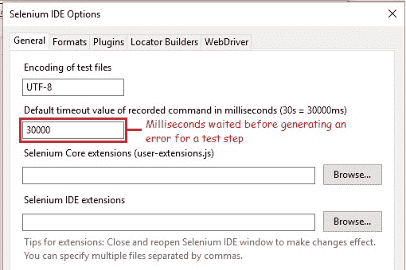
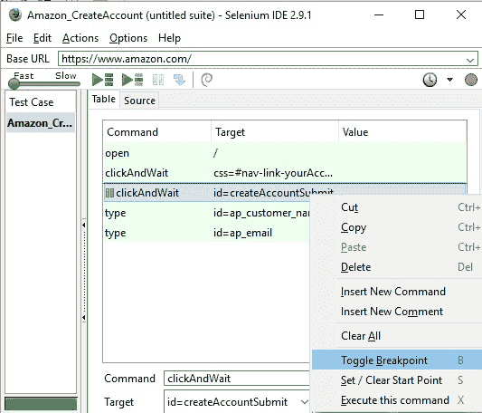
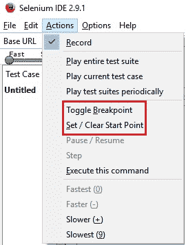
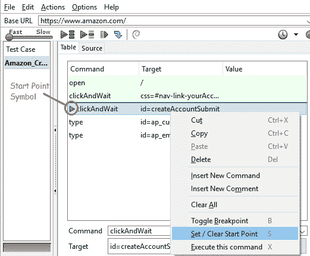

# 7i。 Selenium IDE – 设置超时，断点，起点

> 原文： [https://javabeginnerstutorial.com/selenium/7i-ide-timeouts-breakpoints-startpoints/](https://javabeginnerstutorial.com/selenium/7i-ide-timeouts-breakpoints-startpoints/)

生活不仅要在 *Magic Meadows* 的土地上玩耍，暂停和停止，还应有更多！ 欢迎回到 Selenium IDE 上的另一篇有趣的文章！

自定义默认超时值 – 这有什么用？ 嗯，让我们看看...

并非网络上的所有事情都如我们所愿发生（如果这样，生活会好得多）。 有时，网页上的特定 Web 元素显示的速度比预期的慢，即以较慢的速度可访问。 这可能会导致在回放我们的自动化测试用例并完全停止执行时出错。 这不是我们所希望的！

相反，我们希望 Selenium IDE 等待更长的时间，即在这种情况下可以访问我们的 Web 元素。

为方便起见，选项菜单的“常规”标签中提供了 ***默认超时值*** 选项，可以更改*。*

上图突出显示的该值表示 Selenium IDE 在生成错误之前希望等待测试步骤执行的时间（以毫秒为单位）。 变得硬核，该请求已发送到服务器，但由于默认值设置为 30000ms（即 30s），因此在 30 秒内没有任何响应。 该值可以适当地增加或减少以适合我们的需求。 这样就克服了超时错误！ 欢呼！！！

***BrainBell*** *– 练习！* 是的，这一点很重要。 不要只盯着屏幕。 输入并执行一些测试方案。 如果我为您做一切，那么您的大脑健康就不会长久。 因此，准备好前进，走在那些坎 bump 的道路上吧！

**下一步**： *断点如何工作？* 询问者可能希望知道……

从而导致测试用例失败。

[动作]菜单中显示的 ***切换断点*** 使我们能够通过简化复杂对象来实现目标。

切换，这意味着如果该断点已经存在，请单击“切换断点”将其删除，反之亦然（就像 Caps Lock 键如何在两种模式之间切换一样）。 因此，将根据断点的现有状态将断点插入或从所选命令中删除。

因此，我们可以在单个测试用例中使用**多个断点**在所需的步骤处暂停执行。 这可以通过以下方式实现：

1.  右键单击特定命令，然后选择“切换断点”选项。

2.选择所需的命令，然后按“ b”或“ B”（**快捷键**）。

3.选择所需的命令； 点击“选项”菜单，然后选择“切换断点”。

一旦执行到达带有断点的命令并暂停以进行移动，我们将再次有 2 个选项，

1.  通过单击工具栏中的**'暂停/恢复'**按钮来恢复执行，如上图所示，或者，
2.  一次单步执行/执行后续命令，单击“ Step”按钮以查看每个命令的确切功能，并找出导致错误的命令。

我同意**'step'**是一个非常棒的功能，在我们必须进行认真的调试时非常方便！ 因此，我将即将发表的帖子完全用于同一主题。

**下一步**： *设置/清除起始点，*这是一个指示器，用于告知 Selenium IDE 必须开始执行的命令。

我们可能希望在一个真正的大型测试案例中重复执行一小组测试步骤。 运行整个测试用例会浪费很多资源。 在这种情况下，我们可以通过两种方式设置起点，

1.  右键单击必须设置起点的命令，然后选择“设置/清除起点”。
2.  选择特定的命令，然后按“ s”或“ S”（**快捷键**）。

在上面显示的示例中，播放将从第三行开始执行。 请务必注意，Firefox 浏览器当前显示的页面上存在**依赖项**。 如果您在错误的页面上无法执行所选命令，则测试用例将在起点失败。 同样，每个测试用例只能有一个**起点**。

为了清除正在设置的起点，请选择带有起点的命令，然后使用快捷键“ S”或右键单击并选择“设置/清除起点”选项。

有了这些知识，我就让您自由地继续今天的 BrainBell！ 是的，*练习*我们刚刚讨论的所有内容，我将在 Selenium IDE 上发表另一篇文章。

祝你有美好的一天！

