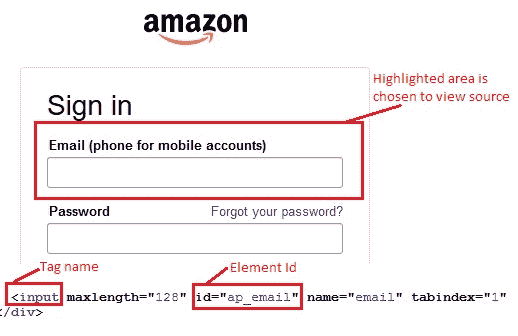
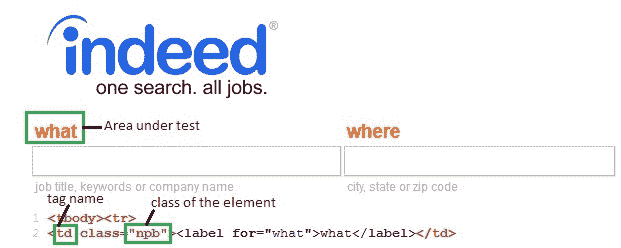
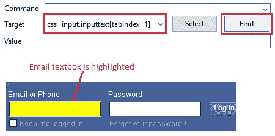
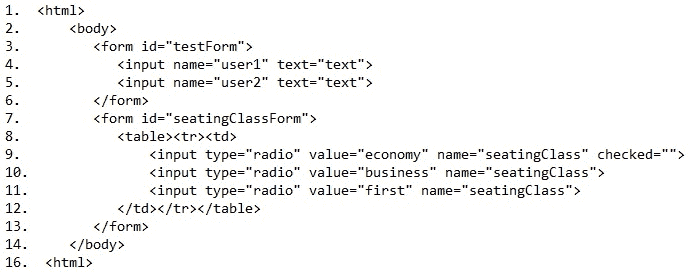

# 7 升 Selenium IDE – 定位元素（续）。

> 原文： [https://javabeginnerstutorial.com/selenium/7l-ide-locating-elements-contd/](https://javabeginnerstutorial.com/selenium/7l-ide-locating-elements-contd/)

Hiya 测试人员！ 我回来了，比赛开始了！ 让我们继续前进，在我们的网页上找到一些古怪的元素！！

在这篇文章中，我们将看到：

定位依据

*   的 CSS
*   判断
*   XPath

让我们一一看一下。

## *通过 CSS 定位*

CSS（层叠样式表）将样式添加到网页中，通常用于描述 HTML 文档的显示或呈现。 为了将这些样式属性绑定到文档中的元素，使用了 **CSS 选择器**。 这些选择器用于根据其名称，id，类，属性等的组合来选择 HTML 元素。

通常，高级 Selenium 用户会通过这种方法在网页上定位元素。 它有点复杂，但主要在元素没有 ID 或名称的情况下首选。

指定目标的格式以标签“ **css =** ”开头，后跟相应的标签名称和其他必需元素。 让我们欣赏使用最常用的 CSS 选择器定位元素的巨大优势。

### *-标签和 ID*

HTML 标记和元素的 ID 与井号（# ）一起使用。

*格式： **css =*** **标签#Id**

*示例：*打开 Amazon 的登录页面。 让我们找到“电子邮件（用于移动帐户的电话）”文本框。

标记名称为“输入”，元素的 ID 为“ ap_email”。

因此，按照目标格式，输入“ **css = input# ap_email** ”并单击“查找”按钮将按预期突出显示网页上的“电子邮件”文本框。

### *-标签和类别*

此方法使用 HTML 标记和要访问的元素的类以及点（。）符号。

*格式： **css =*** **tag.class**

*示例：*打开 Indeed.com，让我们突出显示文本“ what”。

标签名称为“ td”，元素的类别为“ npb”。

输入“ **css = td.npb** ”，然后单击“查找”按钮，将突出显示文本“ what”。 如果多个元素具有相同的标记和类名称，则仅会识别与条件匹配的第一个元素。 在这种情况下必须使用过滤器。 在之前的博客文章中对此概念进行了详细说明。

### *-标签和属性*

在此方法中使用 HTML 标记，最好使用要访问的元素的唯一属性及其对应的值。 属性和值用方括号[]括起来。

*格式： **css =*** **标签[属性=值]**

*示例：*打开亚马逊登录页面，让我们找到“电子邮件”文本框。

标签名称为“输入”，属性为“名称”，其对应值为“电子邮件”。

为 Target 输入“ **css = input [name = email]** ”，然后单击“查找”按钮，将突出显示“ Emal”文本框。

### *-标签，类和属性*

这与“标记和属性”定位策略相似，但是带有类名和点（。）符号。 通常在两个 Web 元素具有相同的标记和类名称时使用。

*格式： **css =*** **tag.class [属性=值]**

*示例：*打开 facebook.com，让我们找到“电子邮件或电话”文本框。

请注意下图，“电子邮件”和“密码”文本框具有相同的标签“输入”和相同的类名“输入文本”，但属性“ tabindex”的值不同。

因此，标签名称为“ input”，类为“ inputtext”，属性为“ tabindex”且其对应值为“ 1”的标签将突出显示“电子邮件或电话”文本框。 属性值与“ 2”相同的组合将突出显示“密码”文本框。

输入“ **css = input.inputtext [tabindex = 1]** ”以突出显示“电子邮件或电话”文本框。

### *-内文*

在某些情况下，id，类或属性未用于特定元素。 要找到这样的元素，可以使用网页上显示的实际文本（内部文本）。

*格式： **css =*** **标签：包含（“内部文本”）**

*示例：*打开亚马逊登录页面，让我们突出显示文本“ Password”。

这里的标签是“标签”，内部文本是“密码”。 输入“ **css = lable：contains（“ Password”）**”高亮显示文本“ Password”。

## *通过 DOM 定位*

文档对象模型是用于表示 HTML 文档中元素的约定。 定位策略利用了 DOM 模型中使用的树结构。 因此，使用分层的点分符号来获取元素的位置。

指定 DOM 定位器时，不需要“ dom =”标签，因为只有 DOM 定位器以单词“ document”开头。

*示例*代码：

*方法 1* ：document.getElementById（“ testForm”）– 使用元素的 ID。

*方法 2* ：document.forms [0] –“表单”将返回文档中使用的所有表单的集合。 因此，使用索引以唯一的方式指定被测元素。

*方法 3* ：document.forms [0] .user1 – 第一种形式，访问 user1 元素。

*方法 4* ：document.getElementsByName（“ seatingClass”）[1] –“ getElementsByName”也将返回括号内指定名称相同的元素集合。 因此，索引返回所需的元素。 在这种情况下，可以访问业务单选按钮。 如果使用索引[0]，则可以访问经济单选按钮。

*方法 5* ：访问 document.forms [“ testForm”]。elements [“ user2”] – 名为“ testForm”的表单的 user2。

*方法 6* ：document.forms [1] .elements [2] – 这将返回“ seatingClassForm”中的“第一个”单选按钮。

现在是时候使用 Selenium IDE 探索 Web 应用的 DOM 了。

## *通过 XPath 定位*

XPath 是一种语法，用于在 XML 文档中导航和定位节点。 由于 HTML 只是 XML 的实现，因此可以使用 XPath 策略来查找所需的元素。

如果找不到合适的 Id，名称或类等来查找元素，则可以使用 XPath。 使用 XPath 定位元素有两种。 一个是绝对路径（不建议使用），因为它会在对现有 HTML 代码进行最小改动的情况下中断。 另一个选项是相对路径 – 使用 ID 或名称查找附近的元素，并使用两者之间的关系使用 XPath 查找所需的元素。 因此，几乎可以使用 XPath 策略定位网页上的任何元素。

这种定位策略非常复杂，通常是高级 Selenium 用户首选的定位策略。 但是不用担心！ 为了使整个 XPath 查找方法变得容易，我们将“ Firebug”作为 Firefox 浏览器的附加组件。 很快您就会遇到一篇博客文章，该文章完全致力于 Firebug 的安装和使用！ 欢呼！！

另外，由于仅 XPath 定位符以“ //”开头，因此不需要为 XPath 定位符指定“ xpath =”。

*示例*：打开 Amazon 登录页面，然后让我们使用 XPath 找到“电子邮件”文本框。

点击 Firebug 图标并检查所需的元素（在本例中为“电子邮件”文本框）。 相应的源代码将显示在网页的下部。

右键点击突出显示的代码，然后选择“复制 XPath”，如下所示。

在目标中，输入一个正斜杠（/），然后使用 Firebug 粘贴复制的 XPath，“ / html / body / div [1] / div [1] / div [3] / div / div [2] / form / div / div / div / div [1] /输入”。 请注意，XPath 定位符应以两个正斜杠开头。

因此，“电子邮件”文本框将按预期突出显示。

你去！ 我们刚刚完成了各种可用的定位策略。 是的，要选择的定位器类型完全取决于要测试的应用。

在将如此多的知识融入您的大脑之后，我知道您将每年两次要求我六个月的假期。 因此，在另一篇文章中再见。

祝你今天愉快！

