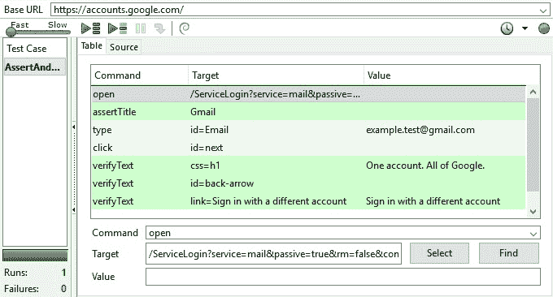
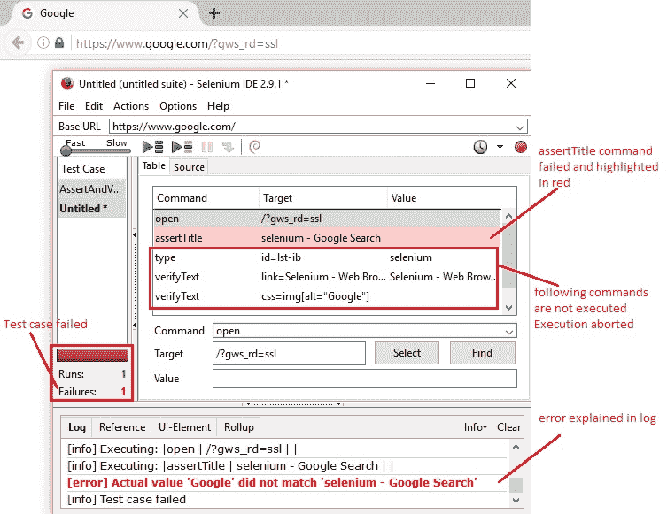
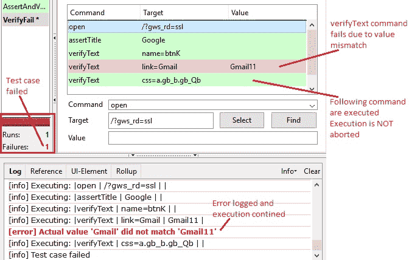
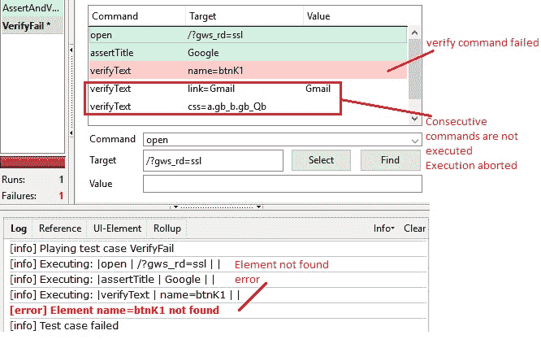

# 7m。 Selenium IDE –声明和验证

> 原文： [https://javabeginnerstutorial.com/selenium/7m-ide-assert-verify/](https://javabeginnerstutorial.com/selenium/7m-ide-assert-verify/)

Hiya测试人员！ 凝视水晶球，我发现在日常测试过程中非常需要断言和验证。 因此，在这里，我们什么也不做，专门为这个主题准备了一个完整的博客，以提高其亮度。

在测试Web应用程序时，我们一直期望以某种方式发生很多事情。 如果没有，则我们将测试声明为失败，然后中止执行或记录该特定异常以进行进一步分析，然后继续进行测试活动。 因此，这两个决定在Selenium中产生了两组不同的命令-声明和验证。

两者的主要区别在于，**声明**将使测试失败，*中止*当前测试用例的执行，而**验证**将使测试失败，但是 *继续运行*测试用例。

## *<u>场景：</u>*

您可能希望检查页面第五段中是否有特定文本。 如果导航页面本身错误，执行这种检查有什么用？ 在这种情况下，建议声明页面URL，然后验证文本是否按预期出现。

您可能希望检查页面上多个属性的可用性。 这可以通过验证每个属性的存在来实现，因为在遇到第一个失败时测试用例不会中止。 这将帮助您同时查看页面的所有失败并采取必要的措施。

## *<u>范例：</u>*

玩的时间到了！ 让我们声明Gmail页面的标题，并进行文本，后退箭头和超链接验证。

*首先，让我们考虑一个全正面的情况。 我们导航到右侧页面，标题为Gmail，输入电子邮件并单击下一步后，将显示文本“一个帐户。 所有Google。”，后退箭头和指向“使用其他帐户登录”的超链接。 测试用例是**成功**。*

*其次，让我们尝试断言失败的情况。 我们将打开google页面并声明其标题为“ Selenium – Google Search”。 这将导致**失败并中止**测试用例，因为当前页面标题将为“ Google”。*

    

*最后*，我们将使verify语句失败，并确保测试用例即使在记录错误并整个测试用例失败之后也能继续执行。 打开Goog​​le页面，声明其标题为“ Google”，验证按钮“ Google Search”，验证超链接“ Gmail”，其值为“ Gmail”，并验证是否存在Google Apps图标。

通过将超链接的值更改为“ Gmail11”而不是“ Gmail”，验证命令将**失败，但是测试用例将继续执行**记录错误。

**当心！ 您可能会遇到*“找不到元素”* 错误*。* 很奇怪：**

即使命令只是一个验证，而我们要验证的元素不在页面上，也不会执行连续的步骤，并且测试用例也会失败。 由于verify通常用于检查文本的存在，并且如果未找到元素本身，则应该在应用程序中存在需要立即解决的错误。 因此结果。

是时候休息一下了！ 练习一些场景并加深断言和验证的知识，迟早会成为 *SeleniumVille* 中生活的重要组成部分。 在另一个帖子中再见！

祝您有美好的一天！

###### 下一篇文章

##### [7n。 Selenium IDE –将Firebug用作优势](https://javabeginnerstutorial.com/selenium/7n-ide-using-firebug/ "7n. Selenium IDE – Using firebug as an advantage")