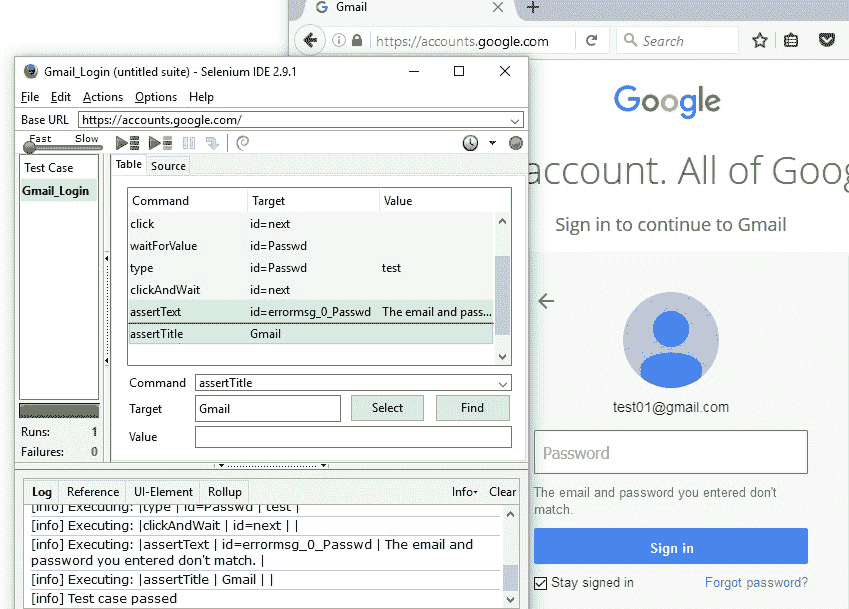
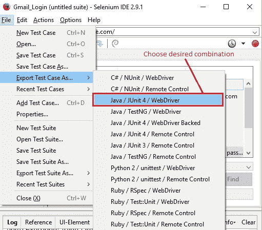
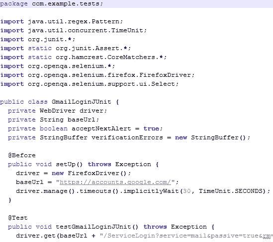
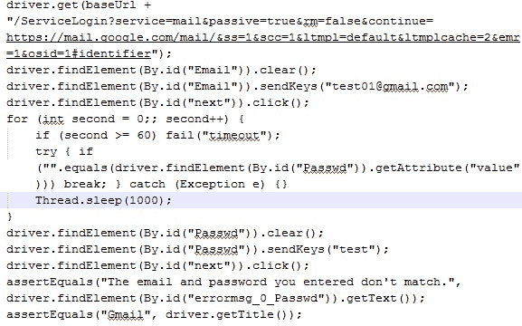

# 7点 Selenium IDE –以所需的语言导出测试用例

> 原文： [https://javabeginnerstutorial.com/selenium/7o-ide-export-testcase/](https://javabeginnerstutorial.com/selenium/7o-ide-export-testcase/)

您是否意识到您现在不再是Selenium的新手？ 最好的部分是，您在使用Selenium IDE方面已经走了很长一段路，并且您将接近其边界！ 因此，以同样的热情，让我们继续前进，并确保在这一美好的旅程中，我们不遗余力！

今天，让我们全神贯注，找出如何以我们希望使用的编程语言导出自动化测试代码。 相信我，除非您真正使用它，否则您不会意识到它有多方便。 那么，我们还等什么呢？ 让我们开始吧！

## 场景：

1.  打开“ Google帐户-登录”页面，网址为https://accounts.google.com。
2.  输入电子邮件ID， [[受电子邮件保护]](/cdn-cgi/l/email-protection#c2b6a7b1b6f2f382a5afa3abaeeca1adaf)
3.  单击下一步，然后输入密码，进行测试。
4.  单击下一步，并确认文本“您输入的电子邮件和密码不匹配。” 出现在屏幕上。
5.  断言当前页面的标题是Gmail。

下图显示了默认表格式视图中的测试用例。

## 将测试用例导出为：

单击文件->将测试用例导出为...->选择所需的编程语言组合（应将所选的测试用例转换为该语言）/单元测试框架/套件中使用该代码的工具。

将文件保存在所需的本地路径中。 在这种情况下，文件将以“ .java”扩展名保存。 双击保存的文件将如下所示打开，

请注意，在这种情况下，一旦导入或粘贴到IDE（例如Eclipse，NetBeans等），导出的测试用例可能会有警告或错误。 对于此单个测试用例，在选择的组合中运行也可能确实不需要一些不必要的代码。 我们将在Selenium WebDriver博客（即将发布）中详细介绍如何相应地编辑文件。 作为自动化测试人员，我总是建议编写代码，而不是记录和生成测试用例。 这么说，“将测试用例导出为……”似乎不是杀手级功能，说实话，它可以使用一些改进，但是对于初学者来说，了解并掌握该工具是一个很好的起点。 。

## 剪贴板格式：

另一种选择是“剪贴板格式”，在“选项”菜单中可用。

这有助于我们选择在执行粘贴操作时希望代码段显示的格式。 HTML是默认选择。 在这种情况下，让我们选择“ Java / Junit4 / WebDriver”。 当选择了测试脚本窗格中的所有命令（Ctrl + a）并执行了副本（Ctrl + c）时，可以通过粘贴（Ctrl + v）获得所选组合的代码段。 粘贴后的结果如下：

因此，借助Selenium IDE的“导出测试用例为”和“剪贴板格式”选项，可以简单地实现目标。 现在该轮到您探索这些功能，并在评论部分提出任何疑问。

在另一篇文章中再见。 祝你有美好的一天！

###### 下一篇文章

##### [7分。 Selenium IDE –其他功能](https://javabeginnerstutorial.com/selenium/7p-ide-features/ "7p. Selenium IDE – Other Features")